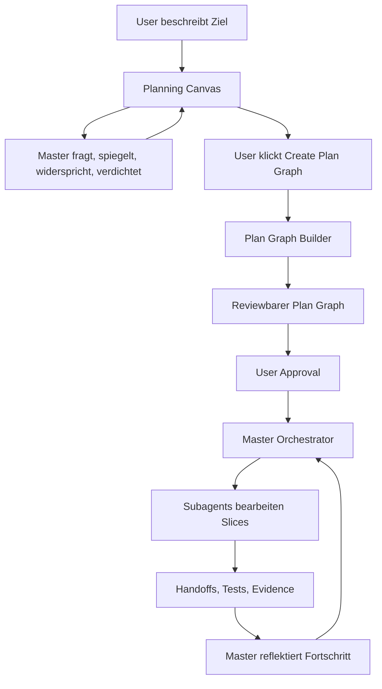

# Feature: Development Orchestration Plan Graph

Stand: 2026-06-16

Dieses Feature beschreibt eine spaetere Odysseus-Faehigkeit fuer automatisierte Development-Orchestration. Es gehoert bewusst **nicht** in die aktuelle Memory-first/Obsidian-Roadmap, sondern ist ein eigenstaendiges Produktfeature fuer eine spaetere Ausbaustufe.

Konkreter erster Umsetzungsplan: `docs/plans/development-orchestration-foundation-roadmap.md`.

## Zielbild

Der Nutzer gibt dem Master-Agenten ein Entwicklungsziel. Der Master erzeugt daraus nicht sofort einen finalen Plan, sondern fuehrt zuerst eine rekursive Plan-Schleife:

- Ziel verstehen
- Annahmen spiegeln
- Alternativen und Risiken diskutieren
- Scope und Nicht-Ziele schaerfen
- moegliche Pfade, Abhaengigkeiten und Konflikte sichtbar machen
- solange iterieren, bis der Nutzer den Diskurs bewusst beendet

Erst wenn der Nutzer explizit auf **Create Plan Graph** geht, wird aus dem Diskurs ein maschinenlesbarer Plan-Graph.

## Kernidee

Die Planung ist zweistufig:

1. **Planning Canvas**
   Freier, rekursiver Diskurs zwischen Nutzer und Master-Agent. Der Plan ist hier noch fluessig.

2. **Plan Graph**
   Strukturierte, ausfuehrbare Darstellung mit Slices, Dependencies, Agent-Zuweisungen, Hot-File-Locks, Testgates, Handoffs und Evidence.

Der Master-Agent darf erst nach Nutzerfreigabe vom Canvas in den Plan Graph wechseln.

## UI-Verhalten

Solange die Session im Planning Canvas ist, zeigt die UI prominent, aber nicht aufdringlich:

```text
Create Plan Graph
```

Der Button bedeutet:

- Der aktuelle Diskurs wird eingefroren.
- Der Master extrahiert Ziele, Constraints, Entscheidungen und offene Fragen.
- Daraus wird ein Plan-Graph als Vorschlag erzeugt.
- Der Vorschlag wird visualisiert und bleibt reviewbar.
- Ohne weiteres Approval werden noch keine Agents gestartet.

## Ablauf



## Plan-Graph-Inhalte

Ein Plan Graph enthaelt mindestens:

- Ziel und Nicht-Ziele
- Slices als Knoten
- Dependencies zwischen Slices
- Parallelisierungsregeln
- Hot Files und Ownership-Locks
- Agent-Rollen und empfohlene Zuweisung
- Testgates pro Slice
- Handoff-Format pro Slice
- Evidence-Anforderungen
- Stoppschilder fuer riskante Arbeit
- Ruecksprungpunkte in den Planning Canvas

## Agentenmodell

Subagents sollen nicht frei planen. Sie bekommen kleine, klare Slices:

- Aufgabe
- erlaubte Dateien
- verbotene Dateien
- Nicht-Ziele
- Tests
- Done-Kriterien
- Handoff-Format

Der Master-Agent owned:

- globale Roadmap
- Plan Graph
- Konfliktvermeidung
- Slice-Verteilung
- Fortschrittsbewertung
- Reflexion
- naechste Auftragsvergabe

## Visualisierung

Die UI soll den Entwicklungsprozess als Graph oder Baum sichtbar machen:

- geplante Slices
- laufende Slices
- erledigte Slices
- blockierte Slices
- Agent-Zuweisungen
- offene Handoffs
- Teststatus
- Review-/Approval-Punkte
- kritische Hot-File-Konflikte

Der Nutzer soll jederzeit verstehen:

- warum ein Agent gerade diesen Slice bearbeitet
- was parallel sicher ist
- was gerade blockiert
- welche Entscheidung als naechstes von ihm gebraucht wird

## Zustandsmodell

Moegliche Slice-Zustaende:

- `draft`
- `approved`
- `ready`
- `running`
- `handoff`
- `verifying`
- `blocked`
- `done`
- `failed`
- `superseded`

Moegliche Plan-Zustaende:

- `canvas`
- `graph_draft`
- `awaiting_approval`
- `executing`
- `paused`
- `complete`
- `aborted`

## Memory-Integration

Der Diskurs und der Plan Graph sollen in das Memory-System eingehen:

- finale Entscheidungen
- verworfene Alternativen
- Begruendungen
- Risikoannahmen
- Handoffs
- Testresultate
- Master-Reflexionen

Wichtig: Nicht nur der finale Plan ist wertvoll. Auch der Weg dorthin erklaert spaeter, warum der Entwicklungsgraph so aussieht.

## Nicht-Ziele fuer die erste Version

- keine vollautonome Ausfuehrung ohne explizites User-Approval
- keine unbegrenzten Agents ohne Resource-/Lock-Modell
- keine Subagents, die eigenstaendig die Gesamtstrategie aendern
- keine automatische Aenderung riskanter Roadmaps ohne Review
- keine UI, die Plan und Ausfuehrung vermischt, bevor der Nutzer den Graph erzeugt hat

## Erster MVP spaeter

Ein spaeterer MVP koennte so aussehen:

1. Planning Canvas mit sichtbarem **Create Plan Graph** Button.
2. Plan Graph wird aus dem Diskurs als JSON plus Visualisierung erzeugt.
3. Nutzer approved den Graph.
4. Master verteilt nur den naechsten `ready` Slice an einen Agent.
5. Agent gibt Handoff in festem Format zurueck.
6. Master prueft Tests/Status und setzt den naechsten Slice frei.

## Produktprinzip

Odysseus soll nicht nur Aufgaben ausfuehren, sondern Entwicklungsprozesse fuehrbar machen.

Der Nutzer denkt mit dem Master im Canvas. Der Master kristallisiert daraus einen Graph. Die Agents folgen dem Graph. Die Lens macht den Prozess sichtbar.
