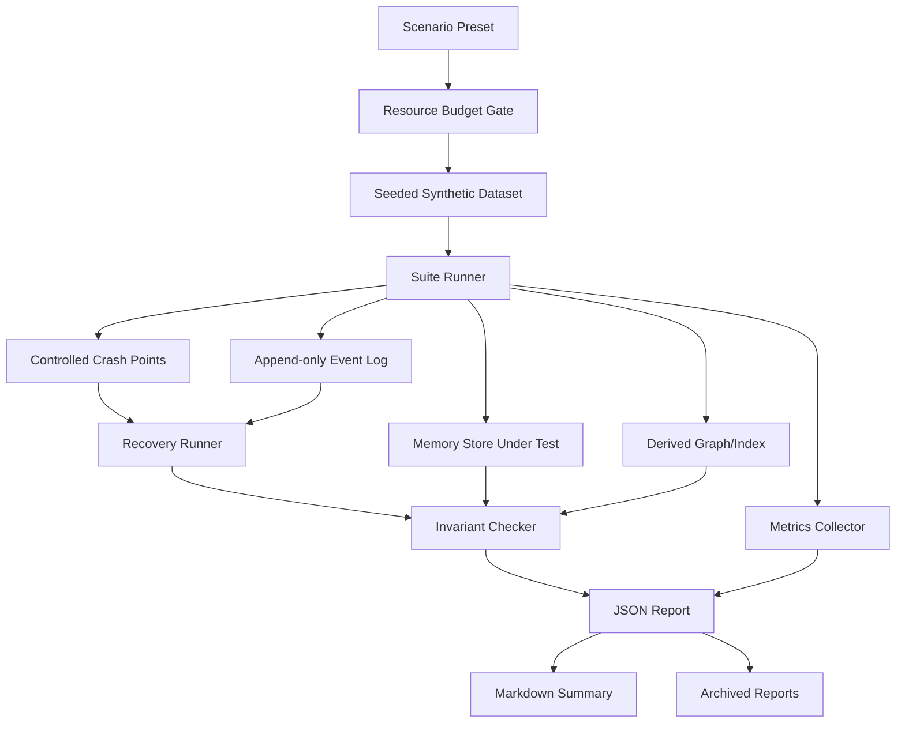

# Memory Durability Performance Suite Roadmap

Stand: 2026-06-19

Status: headless MVP implemented for synthetic crash/recovery, performance gates and report archive

## Goal

Build a small testing suite that proves committed memory data is not lost across controlled crash/restart/rebuild scenarios and measures performance bottlenecks in ingest, write, replay, rebuild and query paths.

## Scope

This is not a full locked-universe simulator. The first version is a narrow, repeatable test harness:

- synthetic data only
- deterministic seeds
- append-only event log proof
- controlled crash points inside the runner
- restart/recovery simulation without crashing the host OS
- phase-level performance metrics
- JSON and Markdown reports
- archived report history
- resource budget gate so the suite cannot exhaust the machine

## Non-Goals

- No real power-off or hardware fault injection.
- No destructive drive tests.
- No live private data.
- No live Nextcloud, SSH, provider or network dependency.
- No OS-level chaos framework.
- No huge parameter matrix in MVP.
- No automatic feature/plugin discovery in the first slice unless the plugin shell makes it cheap.

## Core Questions

1. If the process stops after a memory write step, can recovery prove no committed event was lost?
2. If derived graph/index data is deleted, can it be rebuilt from the committed event log?
3. Are duplicate ingests idempotent?
4. Does any report or durable artifact contain raw content or secrets?
5. Which phase is slow: synthetic generation, ingest, abstraction write, graph write, replay, rebuild or query?
6. How much memory and temp disk does a run consume, and does it stay inside budget?

## MVP Architecture



## Resource Safety

The suite is allowed to test memory durability; it is not allowed to endanger the operator workstation.

Operator contract:

- Default runs are conservative and must be safe on a normal developer machine.
- Stress runs are opt-in and must show estimated RAM, temp disk and runtime before starting.
- Manual override is a deliberate operator action, not a config default.
- The runner must fail closed: refuse, downscale or abort before host pressure becomes dangerous.
- Resource observations must be numeric summaries only; do not persist hostnames, user paths or private process details.

Initial budget classes:

- default suite cap: 4 GB RAM
- stress cap: 8 GB RAM
- absolute cap: 10 GB RAM only with explicit manual override
- emergency abort when available RAM drops below 2 GB

Budget gate:

- estimate RAM, temp storage and runtime before run
- refuse when a preset exceeds its hard cap
- downscale only when the preset explicitly allows it and the report records the effective size
- track peak memory and temp disk during run
- reduce batch size when approaching a soft cap
- cancel cooperatively when the operator requests stop
- abort cleanly when emergency thresholds are reached
- write a No-Go report instead of leaving a partial durable artifact set without status

## Presets

Preset names are operator promises, not just parameter bundles:

- `quick` is the default smoke proof for local iteration.
- `standard` is the normal confidence run before depending on the suite result.
- `stress_local` is an explicit local stress run and must never be selected automatically.

Each preset must define:

- synthetic document count
- average edge density
- max RAM
- max runtime
- downscale policy
- expected decision class when all invariants pass

```yaml
quick:
  docs: 1000
  avg_edges_per_doc: 10
  max_ram_mb: 512
  max_runtime_seconds: 120
  downscale: false
  expected_decision: go

standard:
  docs: 10000
  avg_edges_per_doc: 20
  max_ram_mb: 2048
  max_runtime_seconds: 600
  downscale: false
  expected_decision: go

stress_local:
  docs: 50000
  avg_edges_per_doc: 30
  max_ram_mb: 6144
  max_runtime_seconds: 1800
  downscale: true
  expected_decision: partial_allowed
```

## Durability Model

MVP durability proof uses controlled crash points:

```text
1. append intent event
2. write memory abstraction
3. mark event committed
4. write derived graph/index
5. archive report
```

For each crash point:

- stop the runner at that point
- restart in recovery mode
- replay committed events
- rebuild derived state
- compare expected committed event ids with recovered state

Required invariants:

- no committed event is lost
- no duplicate canonical memory is created for the same event id/source hash
- derived graph/index can be rebuilt from committed events
- uncommitted intent events are either ignored or repaired with explicit status
- raw content and secrets never appear in event log, graph, reports or archives

## Performance Metrics And Gates

Each report records:

- total runtime
- synthetic data generation time
- ingest time
- event log append p50/p95/p99
- memory abstraction write p50/p95/p99
- graph/index write p50/p95/p99
- replay time
- rebuild time
- query p50/p95/p99
- peak RSS / process memory
- estimated vs observed RAM
- temp disk usage
- event count
- node count
- edge count
- duplicate count
- recovery count
- invariant check time

The headless MVP also enforces performance gates:

- runtime must stay under the scenario budget
- peak process RSS delta must stay under the scenario memory budget
- temp/run-directory disk usage must stay under the scenario log budget
- performance gate failure marks the run `failed` even when recovery invariants pass
- report archives include `performance_summary.json`
- summary comparisons can flag regressions for runtime, memory and temp disk usage

## Report Archive

Reports are durable operator evidence. They must explain the decision without exposing private content or host-specific details.

Suggested archive layout:

```text
reports/memory_durability_perf/
  <utc-run-id>-<preset>-seed-<seed>/
    scenario.json
    report.json
    report.md
    metrics.jsonl
```

Reports must be safe to keep:

- synthetic data only
- no raw private content
- no tokens, passwords, chat IDs, hostnames, absolute user paths or provider identifiers
- compact failure taxonomy
- stable result hash for reproducibility
- explicit decision: Go, Partial, No-Go or Deferred
- explicit resource summary: estimated and observed RAM/temp disk/runtime
- explicit artifact status: complete, aborted_with_report or invalid_no_archive

Archive write rules:

- write reports into a run-specific directory only after the scenario is validated
- do not overwrite an existing run directory
- write incomplete runs with an explicit aborted status
- keep metrics bounded; do not append unbounded logs
- keep scenario inputs synthetic and reproducible from preset plus seed

## Failure Taxonomy

- `durability_failure`
- `recovery_failure`
- `rebuild_mismatch`
- `idempotency_failure`
- `raw_content_leak`
- `secret_leak`
- `performance_budget_exceeded`
- `resource_budget_exceeded`
- `timeout`
- `invalid_scenario`
- `nondeterminism_detected`

## Plugin Shape

The suite can later become its own plugin.

MVP plugin responsibilities:

- show available presets
- allow seed and size selection
- show estimated RAM/temp disk/runtime
- start a run only after budget gate passes
- stream live structured status
- show current phase and metrics
- allow cancel
- list archived reports
- open JSON/Markdown report

Headless responsibilities:

- run the same scenario from CLI or test command
- produce the same report artifacts
- return non-zero on No-Go failure

## Live Feedback Events

The runner should emit structured events:

```json
{
  "run_id": "quick-seed-1234",
  "phase": "replaying",
  "progress": 0.72,
  "events_committed": 1000,
  "events_recovered": 1000,
  "peak_ram_mb": 384,
  "warnings": []
}
```

Required phases:

- `queued`
- `estimating`
- `generating`
- `ingesting`
- `crash_point`
- `recovering`
- `replaying`
- `rebuilding`
- `querying`
- `checking_invariants`
- `reporting`
- `archived`
- `failed`
- `cancelled`

Operator-visible status terms:

- `queued`: accepted but not started
- `estimating`: budget gate is calculating cost
- `running`: active work is in progress
- `cancelling`: operator stop was accepted and cleanup is running
- `archived`: report artifacts were written safely
- `failed`: report contains a No-Go or invalid scenario result
- `cancelled`: operator stopped the run and an aborted report was written if possible

## ABC Execution Plan

### MDPS-ABC0 Roadmap

Owner: Charlie

Goal:

- Store this roadmap as the durable planning artifact.

Allowed files:

- `docs/plans/memory-durability-performance-suite-roadmap.md`

Tests:

- `git diff --check`

### MDPS-ABC1 Contract And Operator UX

Owner: Alice

Execution mode: worker

Goal:

- Refine operator-facing language for presets, Go/Partial/No-Go, reports, and resource safety.

Allowed files:

- `docs/plans/memory-durability-performance-suite-roadmap.md`

Tests:

- Docs-only. Run `git diff --check`.

### MDPS-ABC2 Scenario And Report Models

Owner: Bob

Execution mode: worker

Goal:

- Implement offline dataclasses/value objects for scenario, budget estimate, metrics and report.

Allowed files:

- `src/memory_perf_suite_models.py`
- `tests/test_memory_perf_suite_models.py`

Tests:

- `venv\Scripts\python.exe -m pytest tests\test_memory_perf_suite_models.py`

### MDPS-ABC3 Synthetic Data And Event Log

Owner: Bob

Execution mode: worker

Goal:

- Implement deterministic synthetic memory events and an append-only in-memory/file-backed test event log.

Allowed files:

- `src/memory_perf_suite_data.py`
- `src/memory_perf_suite_eventlog.py`
- `tests/test_memory_perf_suite_eventlog.py`

Tests:

- `venv\Scripts\python.exe -m pytest tests\test_memory_perf_suite_eventlog.py`

### MDPS-ABC4 Crash Recovery Proof

Owner: Bob

Execution mode: worker

Goal:

- Add controlled crash-point simulation and recovery invariant checks.

Allowed files:

- `src/memory_perf_suite_runner.py`
- `src/memory_perf_suite_invariants.py`
- `tests/test_memory_perf_suite_recovery.py`

Tests:

- `venv\Scripts\python.exe -m pytest tests\test_memory_perf_suite_recovery.py`

### MDPS-ABC5 Performance Metrics

Owner: Bob

Execution mode: worker

Goal:

- Add phase timers, latency summaries and resource observations without requiring large datasets.

Allowed files:

- `src/memory_perf_suite_metrics.py`
- `tests/test_memory_perf_suite_metrics.py`

Tests:

- `venv\Scripts\python.exe -m pytest tests\test_memory_perf_suite_metrics.py`

### MDPS-ABC6 Report Archive

Owner: Charlie

Execution mode: worker

Goal:

- Integrate reports and archive layout, with redaction/no-raw-content checks.

Allowed files:

- `src/memory_perf_suite_reports.py`
- `tests/test_memory_perf_suite_reports.py`
- `docs/plans/memory-durability-performance-suite-roadmap.md`

Tests:

- `venv\Scripts\python.exe -m pytest tests\test_memory_perf_suite_reports.py`

### MDPS-ABC7 Plugin Shell Deferred

Owner: Charlie

Execution mode: worker later

Goal:

- Create plugin UI only after the headless suite is useful.

Deferred allowed files:

- `plugins/memory_perf_suite/`
- `tests/test_memory_perf_suite_plugin.py`

## Final Verification

Focused suite:

```text
venv\Scripts\python.exe -m pytest tests\test_memory_perf_suite_models.py tests\test_memory_perf_suite_eventlog.py tests\test_memory_perf_suite_recovery.py tests\test_memory_perf_suite_metrics.py tests\test_memory_perf_suite_reports.py
git diff --check
```

Current implementation files:

- `src/memory_perf_suite_models.py`
- `src/memory_perf_suite_data.py`
- `src/memory_perf_suite_eventlog.py`
- `src/memory_perf_suite_invariants.py`
- `src/memory_perf_suite_metrics.py`
- `src/memory_perf_suite_runner.py`
- `src/memory_perf_suite_reports.py`

Current focused tests:

- `tests/test_memory_perf_suite_models.py`
- `tests/test_memory_perf_suite_eventlog.py`
- `tests/test_memory_perf_suite_recovery.py`
- `tests/test_memory_perf_suite_metrics.py`
- `tests/test_memory_perf_suite_reports.py`

## Go / Partial / No-Go

Decision terms are operator-facing release gates:

- Go means the suite produced complete evidence for the selected preset and all required invariants passed.
- Partial means the run produced useful evidence but is explicitly not a full release gate.
- No-Go means the suite found a correctness, safety, secrecy or resource-control failure.
- Deferred means the capability is intentionally out of scope for the current slice.

Go:

- quick preset runs deterministically with a fixed seed
- recovery proof passes every MVP crash point
- committed event count equals recovered event count
- rebuild from event log matches expected derived state
- reports archive JSON and Markdown safely
- performance gate passes for runtime, memory delta and temp disk usage
- performance summary is archived and comparable against a baseline summary
- no raw content or secret values appear in durable artifacts
- resource budget gate prevents unsafe runs
- report archive is complete and marked Go

Partial:

- scenario/report models and basic metrics work
- recovery proof exists but covers only one crash point
- archive works but plugin UI is not started
- performance metrics exist but historical comparison is deferred
- stress preset downscaled within an allowed policy and all completed invariants passed
- report clearly states which evidence is missing

No-Go:

- any committed event can be lost silently
- duplicate canonical memory can be created by retry/recovery
- raw content or secret values appear in event log/report/archive
- resource budget can be exceeded without clean abort
- performance budget can be exceeded while the run still reports Go
- tests require live private data or live services
- report archive is missing, overwritten or ambiguous after a run starts

Deferred:

- full plugin UI
- automatic plugin/feature discovery
- real drive-failure testing
- large stress matrix
- CI release-gate integration

## Stop Rules

Stop immediately and hand off if any of these become true:

- live data, live services, SSH, provider calls or network access become necessary
- a test would write outside its temp/run directory or the approved report archive root
- a destructive filesystem action is required
- private content, tokens, passwords, chat IDs, hostnames, absolute user paths or provider identifiers would enter fixtures, logs or reports
- resource control cannot estimate and cap RAM/temp disk/runtime before the run starts
- emergency thresholds are reached and the runner cannot write a bounded abort report
- unrelated dirty files would need to be edited or staged
- a preset's operator promise cannot be kept without changing scope

## First Useful Slice

Start with MDPS-ABC2 and MDPS-ABC3. Do not build the plugin first.

The first useful proof is:

```text
seeded synthetic events -> append-only event log -> crash point -> recovery -> invariant report
```

Once that is green, add performance gates and report archiving. The plugin shell comes after the headless suite proves value.
