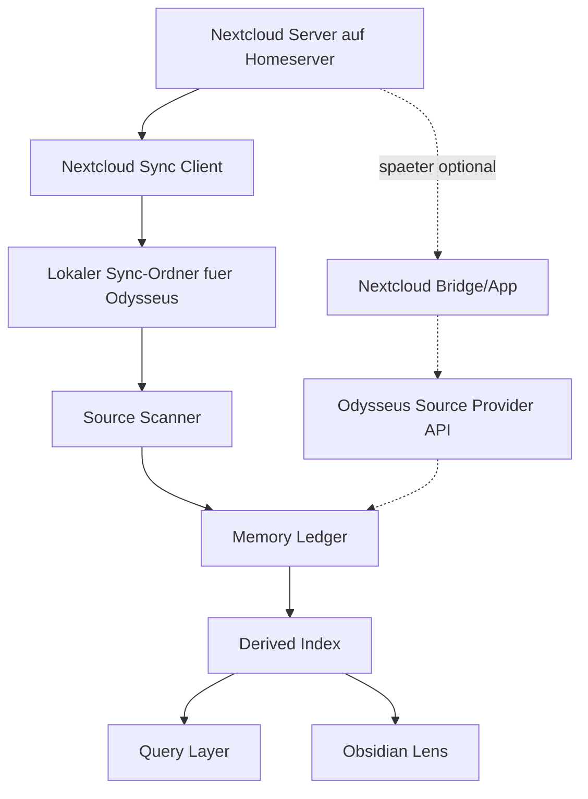

# Feature: Nextcloud Source Bridge

Stand: 2026-06-16

Dieses Dokument beschreibt die geplante Nextcloud-Anbindung fuer Odysseus. Es ist ein eigenstaendiges Feature-Dokument und gehoert bewusst nicht in die aktuelle Memory-first/Obsidian-Roadmap.

Status: **ausgelagert / pausiert**.

Diese Planung wird erst aktiv, wenn die Nextcloud-Instanz auf dem Homeserver laeuft. Bis dahin bleibt Nextcloud kein Implementierungs- oder 1.0-Finalisierungsscope, sondern ein vorbereiteter spaeterer Source-Provider.

## Zielbild

Nextcloud wird der private Sync- und Archiv-Layer fuer Odysseus:

- Nutzerdateien liegen auf der eigenen Nextcloud-Instanz auf dem Homeserver.
- Odysseus kann diese Dateien als Quellen fuer das Memory-System indexieren.
- Der erste Ansatz nutzt lokalen Nextcloud-Sync wie bei einem normalen Client.
- Spaeter kann eine Nextcloud-Bridge oder ein Nextcloud-Plugin hinzukommen, falls Sync allein nicht reicht.

Der Kern bleibt: Nextcloud ist **Source Provider**, nicht automatisch Canonical Memory und nicht automatisch Published Output.

## Startbedingung

Diese Roadmap darf erst in aktive Slices uebersetzt werden, wenn:

- Nextcloud auf dem Homeserver laeuft.
- Docker/Storage/Backup-Grundsetup fuer Nextcloud entschieden ist.
- Der Odysseus-Zugriff praktisch waehlbar ist: lokaler Sync, eigener KI-User, App-Passwort oder Bridge.
- Klar ist, welche Ordner read-only Quellen sind und welche Ordner Staging/Generated/Published enthalten duerfen.

## Grundentscheidung

MVP:

```text
Nextcloud Server -> lokaler Sync-Ordner auf Odysseus Host -> Memory Ledger -> Derived Index -> Query/Lens
```

Warum:

- einfach zu verstehen
- wenig Spezialintegration
- kompatibel mit existierenden Nextcloud-Clients
- Odysseus sieht Dateien wie normale lokale Dateien
- Memory-first Ledger/Index kann ohne Nextcloud-Speziallogik starten

Spaetere Erweiterung:

```text
Nextcloud Server -> Bridge/App/API -> Odysseus Source Provider -> Memory Ledger
```

Diese Erweiterung wird nur gebaut, wenn lokaler Sync nicht genug ist.

## Architektur



## Rollen

### Nextcloud

- speichert und synchronisiert Nutzerdateien
- stellt Accounts, Shares und Rechte bereit
- bleibt das System fuer Dateiablage und Geraetesync

### Odysseus

- liest freigegebene/synchronisierte Quellen
- erkennt Aenderungen ueber Ledger, Hashes, mtime und Source Provider
- baut abgeleitete Memory-Daten
- beantwortet Fragen mit Quellen und Confidence
- visualisiert Quellen und Indexzustand in der Lens

### Obsidian Lens

- zeigt Quellen, Graph, Review Queue und Published Views
- erklaert, welche Datei woher kommt
- unterscheidet Source, Derived Data, Review und Published Output

## Sicherheitsmodell

Odysseus soll nicht als allmaechtiger Nutzer in Nextcloud arbeiten.

Empfohlene Rechte:

- Archiv- und Nutzerordner: read-only fuer Odysseus
- `AI Memory/Inbox`: create-only oder write-limited
- `AI Memory/Review Queue`: create/update fuer Staging
- `AI Memory/Generated`: create/update fuer generierte Artefakte
- `AI Memory/Published`: nur nach expliziter Policy oder Review
- Loeschungen: initial keine echten Deletes durch Odysseus

Die KI bekommt idealerweise einen eigenen Nextcloud-Benutzer oder ein eigenes App-Passwort.

## Schreibmodell

### Erlaubt im MVP

- lokale Dateien lesen
- abgeleitete Indexdaten erzeugen
- neue Staging-/Generated-Dateien in klar abgegrenzten Bereichen erzeugen
- Review Queue fuellen
- Published Views nach expliziter Freigabe materialisieren

### Nicht erlaubt im MVP

- stille Aenderung menschlicher Originaldateien
- automatische Deletes
- automatische Moves aus Archivordnern
- automatische Canonical Promotion
- Konfliktaufloesung in Nextcloud-Dateien

## Detection von neuen Daten

Im MVP erkennt Odysseus neue Nextcloud-Daten wie normale Dateisystemdaten:

- periodischer Ledger Sync
- Hash-/mtime-Vergleich
- Status: `pending`, `indexed`, `stale`, `failed`, `deleted`
- optional spaeter Filesystem-Watcher

Nextcloud selbst muss dafuer zuerst keine Events an Odysseus schicken.

Spaeter kann eine Bridge/App Events liefern:

- Datei erstellt
- Datei geaendert
- Datei geloescht
- Share geaendert
- Tag/Metadata geaendert
- Review-/Published-Ordner geaendert

## Everything / Filesystem Search

Everything oder eine andere lokale Suchmaschine ist optionaler Beschleuniger:

- schnelle initiale Discovery
- Pfadreparatur nach Moves
- Suche nach Dateinamen oder bekannten Archivpfaden
- Health Checks gegen den Ledger

Everything ist nicht der Memory-Kern. Der Memory-Kern bleibt Ledger, Derived Index und Query Layer.

## Bridge/App-Erweiterung

Eine Nextcloud-Bridge oder ein Nextcloud-Plugin wird erst sinnvoll, wenn mindestens eines dieser Probleme real auftritt:

- lokaler Sync ist zu langsam oder zu teuer
- Odysseus braucht serverseitige Events statt Polling
- Rechte muessen feiner als Ordnerrechte modelliert werden
- Staging/Review soll direkt in Nextcloud sichtbar und kontrollierbar sein
- Audit Logs sollen in Nextcloud selbst auftauchen
- grosse Archive sollen nicht komplett lokal synchronisiert werden

Moegliche Bridge-Funktionen:

- Webhook/Event-Forwarding an Odysseus
- Source Provider API fuer serverseitige Datei-Metadaten
- sicherer Staging-Upload
- Audit-Log fuer KI-Aktionen
- Review-/Approval-UI in Nextcloud
- Policy-Gate fuer Writes
- Dry-run/Diff vor Veraenderungen

## UI / Lens-Konzept

Die Odysseus-Lens soll Nextcloud-Dateien nicht wie interne Notizen behandeln.

Source View zeigt spaeter:

- Source Provider: `nextcloud_sync` oder `nextcloud_bridge`
- lesbarer Pfad
- Sync-/Indexstatus
- Dateiart
- letzter Indexzeitpunkt
- Confidence/Provenance bei Query-Treffern
- Hinweis, ob die Datei read-only, staged oder published ist

Nutzertexte muessen klar machen:

- "gefunden" bedeutet nicht "kanonisch"
- "indexiert" bedeutet nicht "umgeschrieben"
- "published" bedeutet bewusste Freigabe oder Policy

## Zustandsmodell

Moegliche Source-Zustaende:

- `discovered`
- `pending`
- `indexed`
- `stale`
- `failed`
- `deleted`
- `permission_denied`
- `needs_review`
- `published`

Moegliche Provider-Zustaende:

- `not_configured`
- `sync_folder_ready`
- `sync_folder_missing`
- `scanning`
- `ready`
- `degraded`
- `failed`

## MVP-Slices

### NC1: Lokaler Sync als Source Provider

Ziel: Odysseus kann einen lokalen Nextcloud-Sync-Ordner als Quelle behandeln.

Scope:

- Konfigurierbarer Source Root
- read-only Scan
- Ledger-Eintraege mit Provider `nextcloud_sync`
- keine Nextcloud-API

### NC2: Source Provider in Memory Ledger

Ziel: Ledger unterscheidet lokale Vault-Quellen und Nextcloud-Sync-Quellen.

Scope:

- Provider-ID
- relativer Source Path
- optional externer Anzeigename
- Hash/mtime/size
- Status und Fehler

### NC3: Lens Source View

Ziel: Nutzer versteht, wo eine Nextcloud-Datei im Memory auftaucht.

Scope:

- Source Provider sichtbar machen
- Indexstatus erklaeren
- read-only vs staged vs published anzeigen
- keine Schreibaktionen

### NC4: Staging/Generated Folders

Ziel: Odysseus kann sichere Outputs in klar abgegrenzten Ordnern erzeugen.

Scope:

- `AI Memory/Review Queue`
- `AI Memory/Generated`
- optional `AI Memory/Published`
- keine stillen Originaldatei-Aenderungen

### NC5: Optional Bridge Discovery

Ziel: Entscheiden, ob eine Nextcloud-App oder Bridge noetig ist.

Scope:

- reale Pain Points sammeln
- Sync-Latenz messen
- Rechte-/Audit-Anforderungen pruefen
- erst danach Bridge/API designen

## Nicht-Ziele fuer die erste Version

- kein vollstaendiger Nextcloud-Client in Odysseus
- keine serverseitige Nextcloud-App im MVP
- keine automatische Loeschung von Nutzerdateien
- keine automatische Konfliktaufloesung
- keine stillen Moves zwischen Archiv, Canonical und Published
- keine Abhaengigkeit von Everything als Pflichtkomponente

## Offene Entscheidungen

- Welche Ordner synchronisiert Odysseus initial?
- Bekommt Odysseus einen eigenen Nextcloud-User oder nur ein App-Passwort?
- Wird der lokale Sync-Ordner auf demselben Host wie Odysseus liegen?
- Wie gross darf das lokale Archiv werden, bevor Bridge/API attraktiver wird?
- Welche Dateiarten sollen im MVP nur als Metadaten indexiert werden?

## Produktprinzip

Nextcloud gibt Odysseus Zugriff auf private Quellen. Odysseus macht daraus fragbares, belegtes Memory. Die Originaldateien bleiben geschuetzt.

Lokaler Sync ist der einfache Anfang. Eine Nextcloud-Bridge oder ein Plugin ist die spaetere Praezisionsstufe, wenn echte Anforderungen es rechtfertigen.
