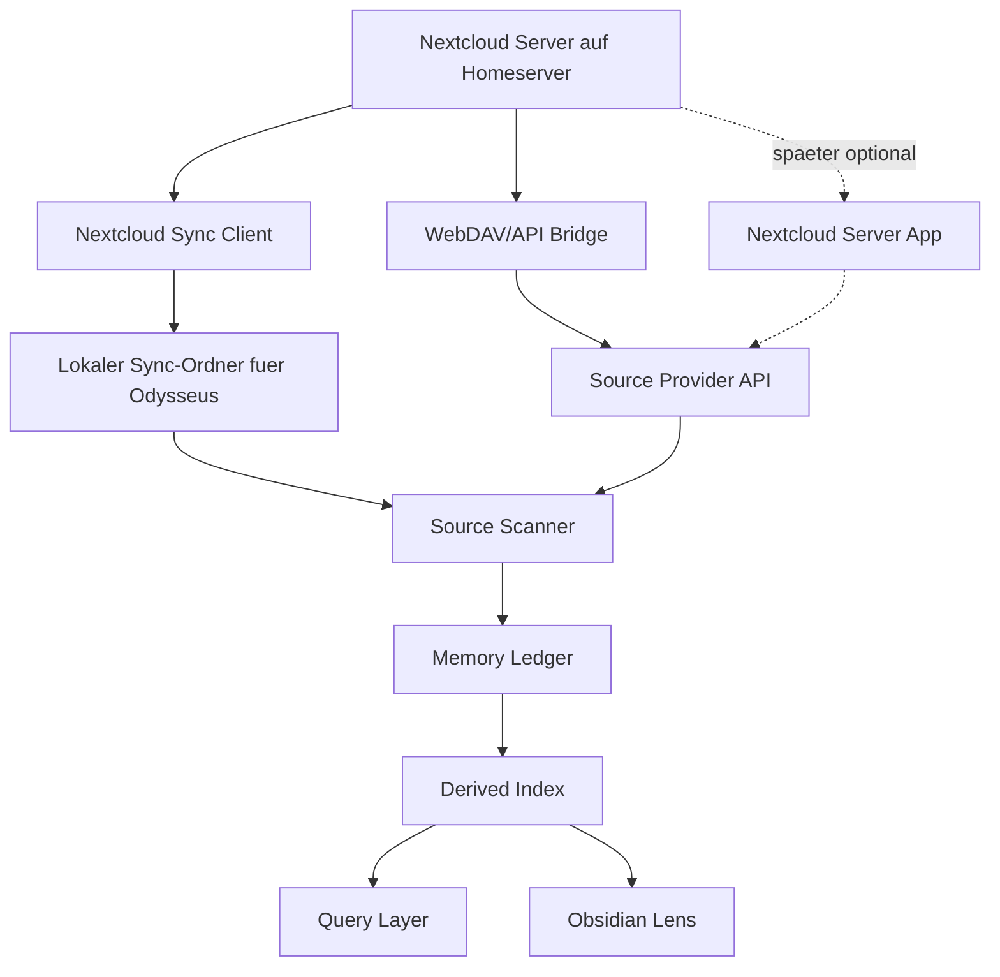

# Feature: Nextcloud Source Bridge

> Master-Roadmap: Fuer neue Alice/Bob/Charlie-Beauftragungen gilt zuerst `docs/plans/unified-odysseus-roadmap.md`. Dieses Dokument bleibt pausierter Detailplan, bis Nextcloud laeuft.

Stand: 2026-06-18

Dieses Dokument beschreibt die geplante Nextcloud-Anbindung fuer Odysseus. Es ist ein eigenstaendiges Feature-Dokument und gehoert bewusst nicht in die aktuelle Memory-first/Obsidian-Roadmap.

Status: **aktivierbar / Infrastruktur vorhanden**.

Die Nextcloud-Instanz laeuft auf dem Homeserver unter Podman. Dieser Plan ist damit nicht mehr rein pausiert, sondern darf in aktive Slices uebersetzt werden. Die Umsetzung bleibt trotzdem nicht Teil eines unkontrollierten 1.0-Finalisierungsscope; sie startet als abgegrenzter Source-Provider- und Inbox-Track.

Implementierungsstand:

- Source-Provider-, Tag-Governance-, Intake-Ledger-, Review-Queue-, Transfer-Readiness- und Control-Adapter-Bausteine existieren als offline getestete Backend-Module.
- Routing und Safe Placement existieren als Dry-Run-Modell: Odysseus kann Zielpfad, Confidence, Review-Gruende, Copy-Plan, Sidecar-Plan und erlaubte Tag-Projektion berechnen, fuehrt aber keine Nextcloud-Schreibaktion aus.
- RaptorGraph-Provenance existiert als abgeleiteter, rebuildbarer Graph-Plan fuer Nextcloud-Dokumente, geplante Pfade, Tags und Dry-Run-Aktionen; kein globaler Rebuild und keine Live-Mutation sind Teil dieses Bausteins.
- Live-Ausfuehrung bleibt separat gegated: Podman/Pods ist die Betriebsannahme; Delete, Move, Overwrite und Admin-Operationen bleiben fuer den MVP-Control-Pfad blockiert.

## Zielbild

Nextcloud wird der private Sync- und Archiv-Layer fuer Odysseus:

- Nutzerdateien liegen auf der eigenen Nextcloud-Instanz auf dem Homeserver.
- Odysseus kann diese Dateien als Quellen fuer das Memory-System indexieren.
- Der erste Ansatz darf wahlweise lokalen Nextcloud-Sync oder eine WebDAV/API-Bridge nutzen.
- Fuer die Universal Inbox ist ein eigener Intake-Track vorgesehen: `docs/plans/universal-inbox-nextcloud-raptorgraph-contract.md`.
- Spaeter kann eine serverseitige Nextcloud-App hinzukommen, falls WebDAV/API-Bridge und Polling nicht reichen.

Der Kern bleibt: Nextcloud ist **Source Provider**, nicht automatisch Canonical Memory und nicht automatisch Published Output.

## Infrastrukturstand

Aktueller Stand:

- Nextcloud laeuft auf dem Homeserver.
- Runtime ist Podman/Pods, nicht Docker. Docker-Begriffe duerfen nur dort auftauchen, wo Dateinamen oder Formate historisch so heissen (`Dockerfile`, `docker-compose.yml`), nicht als Live-Betriebsannahme.
- Nextcloud Deck ist installiert, aber nicht Kern der Intake-Automation.
- Der Odysseus-Zugriff soll ueber einen designierten Nextcloud-User erfolgen.
- Dieser User darf initial keine Loeschrechte haben.
- App-Passwort/WebDAV/API-Zugriff ist der bevorzugte Zugriffspfad fuer Automationen.
- Lokaler Sync bleibt moeglich, ist aber nicht mehr die einzige MVP-Route.
- Nextcloud-Tags und RaptorGraph-Tags werden ueber ein kanonisches Odysseus-Tag-Vokabular zusammengehalten, damit Nextcloud weiterhin als praktische Such- und Filteroberflaeche funktioniert.

Vor Implementierung noch zu klaeren:

- Name des designierten Nextcloud-Users, empfohlen: `odysseus-intake`.
- Ordnerstruktur und Shares fuer Inbox, Archiv, Review und Generated.
- Wie "keine Loeschrechte" technisch erzwungen wird: Ordnerfreigaben, Share-Rechte, Workflow/ACL oder serverseitige Policy.
- Ob das MVP per WebDAV/API arbeitet oder zunaechst mit lokalem Sync startet.

## Grundentscheidung

MVP-Option A: lokaler Sync

```text
Nextcloud Server -> lokaler Sync-Ordner auf Odysseus Host -> Memory Ledger -> Derived Index -> Query/Lens
```

Warum:

- einfach zu verstehen
- wenig Spezialintegration
- kompatibel mit existierenden Nextcloud-Clients
- Odysseus sieht Dateien wie normale lokale Dateien
- Memory-first Ledger/Index kann ohne Nextcloud-Speziallogik starten

MVP-Option B: WebDAV/API-Bridge

```text
Nextcloud Server -> Bridge/App/API -> Odysseus Source Provider -> Memory Ledger
```

Diese Option ist fuer die Universal Inbox attraktiver, weil Odysseus dann serverseitige Dateiaktionen, Tags, Kommentare und Metadaten setzen kann, ohne einen vollstaendigen lokalen Sync aller Dateien vorauszusetzen.

Nicht-MVP: serverseitige Nextcloud-App

Eine echte Nextcloud-App bleibt spaeterer Praezisionsausbau fuer Events, serverseitige Policy, Review-UI oder Audit-Integration.

## Architektur



## Rollen

### Nextcloud

- speichert und synchronisiert Nutzerdateien
- stellt Accounts, Shares und Rechte bereit
- bleibt das System fuer Dateiablage und Geraetesync

### Odysseus

- liest freigegebene/synchronisierte Quellen
- erkennt Aenderungen ueber Ledger, Hashes, mtime und Source Provider
- baut abgeleitete Memory-Daten
- beantwortet Fragen mit Quellen und Confidence
- visualisiert Quellen und Indexzustand in der Lens

### Obsidian Lens

- zeigt Quellen, Graph, Review Queue und Published Views
- erklaert, welche Datei woher kommt
- unterscheidet Source, Derived Data, Review und Published Output

## Sicherheitsmodell

Odysseus soll nicht als allmaechtiger Nutzer in Nextcloud arbeiten.

Empfohlene Rechte:

- Archiv- und Nutzerordner: read-only fuer Odysseus
- `AI Memory/Inbox`: create-only oder write-limited
- `AI Memory/Review Queue`: create/update fuer Staging
- `AI Memory/Generated`: create/update fuer generierte Artefakte
- `AI Memory/Published`: nur nach expliziter Policy oder Review
- Loeschungen: initial keine echten Deletes durch Odysseus

Die KI bekommt einen eigenen Nextcloud-Benutzer, idealerweise `odysseus-intake`, plus App-Passwort. Der normale menschliche Admin-User wird nicht fuer Automationen verwendet.

No-Delete-Prinzip:

- Der designierte Odysseus-User bekommt initial keine Loeschrechte.
- Automationen duerfen keine Originaldateien loeschen.
- Echte Moves sind initial verboten, weil sie je nach Backend Rename/Delete-Semantik haben koennen.
- Stattdessen arbeitet das MVP mit Kopie, Tag, Metadaten und Ledger-Status.
- Cleanup/Archivbereinigung ist ein separater, spaeterer Operator-Job mit explizitem Review.
- Frei generierte LLM-Tags duerfen nicht direkt in Nextcloud geschrieben werden; sichtbare Tags brauchen Allowlist/Mapping, Confidence und Ledger-Provenance.

## Schreibmodell

### Erlaubt im MVP

- lokale Dateien lesen
- Dateien ueber WebDAV/API lesen, wenn diese Route gewaehlt wird
- abgeleitete Indexdaten erzeugen
- neue Staging-/Generated-Dateien in klar abgegrenzten Bereichen erzeugen
- Review Queue fuellen
- Published Views nach expliziter Freigabe materialisieren
- Nextcloud-Tags und maschinenlesbare Sidecar-Metadaten setzen, wenn der designierte User die Rechte hat
- eigene `odysseus-*` Systemtags setzen und semantische Tags nur aus dem kanonischen Mapping projizieren

### Nicht erlaubt im MVP

- stille Aenderung menschlicher Originaldateien
- automatische Deletes
- automatische Moves aus Inbox- oder Archivordnern
- automatische Canonical Promotion
- Konfliktaufloesung in Nextcloud-Dateien
- Nutzung eines menschlichen Admin-Accounts fuer KI-Automationen
- Entfernen oder Umbenennen manueller Nutzer-Tags
- Schreiben ungepruefter freier KI-Tags in Nextcloud

## Detection von neuen Daten

Im MVP erkennt Odysseus neue Nextcloud-Daten wie normale Dateisystemdaten:

- periodischer Ledger Sync
- Hash-/mtime-Vergleich
- Status: `pending`, `indexed`, `stale`, `failed`, `deleted`
- optional spaeter Filesystem-Watcher

Nextcloud selbst muss dafuer zuerst keine Events an Odysseus schicken.

Spaeter kann eine Bridge/App Events liefern:

- Datei erstellt
- Datei geaendert
- Datei geloescht
- Share geaendert
- Tag/Metadata geaendert
- Review-/Published-Ordner geaendert
- Inbox-Datei klassifiziert
- Inbox-Datei geroutet
- RaptorGraph/Derived-Index-Eintrag erzeugt

## Everything / Filesystem Search

Everything oder eine andere lokale Suchmaschine ist optionaler Beschleuniger:

- schnelle initiale Discovery
- Pfadreparatur nach Moves
- Suche nach Dateinamen oder bekannten Archivpfaden
- Health Checks gegen den Ledger

Everything ist nicht der Memory-Kern. Der Memory-Kern bleibt Ledger, Derived Index und Query Layer.

## Bridge/App-Erweiterung

Eine Nextcloud-Bridge oder ein Nextcloud-Plugin wird erst sinnvoll, wenn mindestens eines dieser Probleme real auftritt:

- lokaler Sync ist zu langsam oder zu teuer
- Odysseus braucht serverseitige Events statt Polling
- Rechte muessen feiner als Ordnerrechte modelliert werden
- Staging/Review soll direkt in Nextcloud sichtbar und kontrollierbar sein
- Audit Logs sollen in Nextcloud selbst auftauchen
- grosse Archive sollen nicht komplett lokal synchronisiert werden
- Universal-Inbox-Routing braucht serverseitige Tags, Kommentare oder Shares ohne lokalen Sync
- No-Delete-Policy muss staerker als normale Share-Rechte erzwungen werden

Moegliche Bridge-Funktionen:

- Webhook/Event-Forwarding an Odysseus
- Source Provider API fuer serverseitige Datei-Metadaten
- sicherer Staging-Upload
- Audit-Log fuer KI-Aktionen
- Review-/Approval-UI in Nextcloud
- Policy-Gate fuer Writes
- Dry-run/Diff vor Veraenderungen
- No-Delete-Guard fuer Odysseus-User
- Server-seitige Inbox-Events fuer neue Dateien

## UI / Lens-Konzept

Die Odysseus-Lens soll Nextcloud-Dateien nicht wie interne Notizen behandeln.

Source View zeigt spaeter:

- Source Provider: `nextcloud_sync` oder `nextcloud_bridge`
- Actor: designierter Nextcloud-User, z. B. `odysseus-intake`
- Permission scope: `no_delete`
- lesbarer Pfad
- Sync-/Indexstatus
- Dateiart
- letzter Indexzeitpunkt
- Confidence/Provenance bei Query-Treffern
- Hinweis, ob die Datei read-only, staged oder published ist

Nutzertexte muessen klar machen:

- "gefunden" bedeutet nicht "kanonisch"
- "indexiert" bedeutet nicht "umgeschrieben"
- "published" bedeutet bewusste Freigabe oder Policy

## Zustandsmodell

Moegliche Source-Zustaende:

- `discovered`
- `pending`
- `indexed`
- `stale`
- `failed`
- `deleted`
- `permission_denied`
- `needs_review`
- `published`
- `routed`
- `routed_indexed`
- `copied`
- `metadata_written`

Moegliche Provider-Zustaende:

- `not_configured`
- `sync_folder_ready`
- `webdav_ready`
- `api_ready`
- `sync_folder_missing`
- `scanning`
- `ready`
- `degraded`
- `failed`

## MVP-Slices

### NC1: Lokaler Sync als Source Provider

Ziel: Odysseus kann einen lokalen Nextcloud-Sync-Ordner als Quelle behandeln.

Scope:

- Konfigurierbarer Source Root
- read-only Scan
- Ledger-Eintraege mit Provider `nextcloud_sync`
- keine Nextcloud-API

### NC2: Source Provider in Memory Ledger

Ziel: Ledger unterscheidet lokale Vault-Quellen und Nextcloud-Sync-Quellen.

Scope:

- Provider-ID
- relativer Source Path
- optional externer Anzeigename
- Hash/mtime/size
- Status und Fehler

### NC3: Lens Source View

Ziel: Nutzer versteht, wo eine Nextcloud-Datei im Memory auftaucht.

Scope:

- Source Provider sichtbar machen
- Indexstatus erklaeren
- Nextcloud-Tags als sichtbare Projektion des kanonischen Tag-Vokabulars anzeigen
- read-only vs staged vs published anzeigen
- keine Schreibaktionen

### NC4: Staging/Generated Folders

Ziel: Odysseus kann sichere Outputs in klar abgegrenzten Ordnern erzeugen.

Scope:

- `AI Memory/Review Queue`
- `AI Memory/Generated`
- optional `AI Memory/Published`
- keine stillen Originaldatei-Aenderungen

### NC5: Optional Bridge Discovery

Ziel: Entscheiden, ob eine Nextcloud-App oder Bridge noetig ist.

Scope:

- reale Pain Points sammeln
- Sync-Latenz messen
- Rechte-/Audit-Anforderungen pruefen
- erst danach Bridge/API designen

### NC6: Universal Inbox Intake

Ziel: Dateien aus einer Nextcloud-Inbox typisieren, inhaltlich analysieren, sinnvoll ablegen, taggen und als RaptorGraph-/Derived-Memory-Eintraege erfassen.

Scope:

- eigener Detailvertrag: `docs/plans/universal-inbox-nextcloud-raptorgraph-contract.md`
- Designated Nextcloud User ohne Loeschrechte
- Intake Ledger
- Inhaltsextraktion fuer PDF, Office, Text, Markdown, HTML, CSV/JSON und spaeter OCR/Audio
- Routing mit Confidence und Review-Gate
- keine stillen Deletes, keine automatische Canonical Promotion
- einheitliche Tag Governance fuer Nextcloud-Tags, Sidecars, Ledger und RaptorGraph

## Nicht-Ziele fuer die erste Version

- kein vollstaendiger Nextcloud-Client in Odysseus ausserhalb der begrenzten Source-/Inbox-Funktionen
- keine serverseitige Nextcloud-App im MVP
- keine automatische Loeschung von Nutzerdateien
- keine automatische Konfliktaufloesung
- keine stillen Moves zwischen Archiv, Canonical und Published
- keine Abhaengigkeit von Everything als Pflichtkomponente

## Offene Entscheidungen

- Welche Ordner synchronisiert Odysseus initial?
- Wie heisst der designierte Nextcloud-User ohne Loeschrechte?
- Wird der Zugriff primaer ueber WebDAV/API oder lokalen Sync gebaut?
- Wird der lokale Sync-Ordner auf demselben Host wie Odysseus liegen?
- Wie gross darf das lokale Archiv werden, bevor Bridge/API attraktiver wird?
- Welche Dateiarten sollen im MVP nur als Metadaten indexiert werden?
- Wie werden Nextcloud-Tags, Sidecars, Ledger und RaptorGraph-Eintraege konsistent gehalten?
- Wo wird das kanonische Tag-Vokabular gepflegt und wer darf es erweitern?
- Welche Tags sind nur graph-intern und werden nicht nach Nextcloud projiziert?

## Produktprinzip

Nextcloud gibt Odysseus Zugriff auf private Quellen. Odysseus macht daraus fragbares, belegtes Memory. Die Originaldateien bleiben geschuetzt.

Lokaler Sync ist der einfache Anfang. Eine Nextcloud-Bridge oder ein Plugin ist die spaetere Praezisionsstufe, wenn echte Anforderungen es rechtfertigen.
