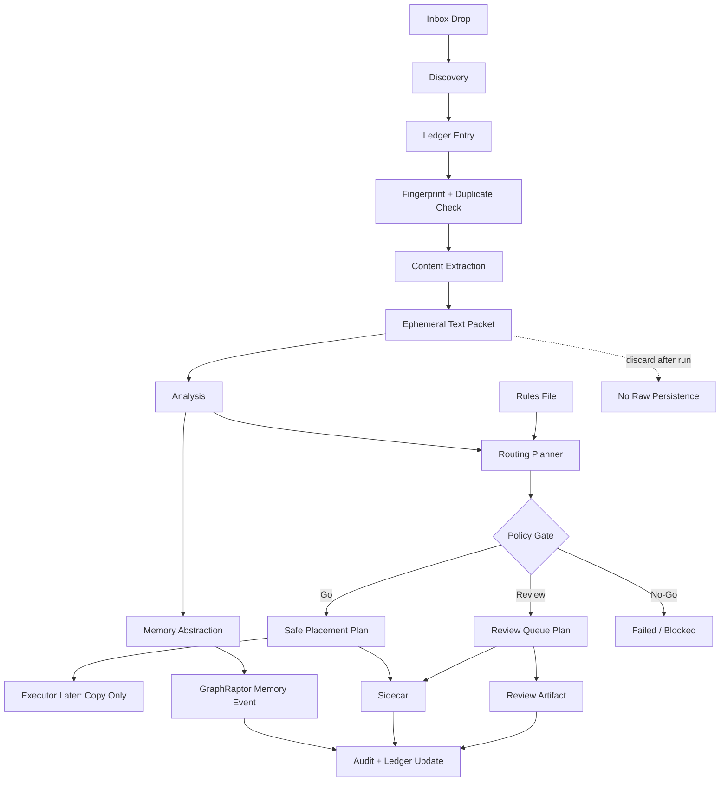
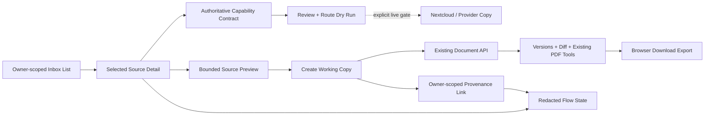

# Universal Inbox ABC Roadmap

Stand: 2026-07-15

Status: active roadmap; UIX-ABC0 bis UIX-ABC11 sind historisch eingeordnet, UIX-ABC12 ist abgeschlossen, die Dokument-Workbench UIX-ABC13 bis UIX-ABC24 ist geplant und noch nicht implementiert

## Goal

Die Universal Inbox verarbeitet abgelegte Dateien end-to-end so, dass Metadaten, Inhaltsabstraktion, Routing-Entscheidung, sichere Ablageplanung, Sidecar, Ledger und GraphRaptor-Memory klar getrennt, testbar und auditierbar sind. Die Fortsetzung ergänzt einen dokumentzentrierten Arbeitsbereich zum Prüfen, Routen, Bearbeiten einer Arbeitskopie und Exportieren, ohne das Original oder bestehende Live-Gates zu umgehen.

## Historical Evidence (2026-06-19)

- Commit `379647bb Add universal inbox routing framework` ist auf `fuzzy/dev` gepusht.
- Rules-Datei existiert: `config/universal_inbox_routing_rules.json`.
- Offline Routing Planner existiert: `src/universal_inbox_routing.py`.
- Routing-Tests existieren: `tests/test_universal_inbox_routing.py`.
- Verifikation: `venv\Scripts\python.exe -m pytest tests\test_universal_inbox_routing.py tests\test_nextcloud_intake_ledger.py tests\test_nextcloud_review_queue.py tests\test_nextcloud_tag_governance.py tests\test_nextcloud_source_provider.py` -> `44 passed`.
- Kein aktiver Alice/Bob/Charlie-Thread wurde fuer diese Roadmap uebernommen.

## Status Reconciliation (2026-07-15)

- UIX-ABC0 bis UIX-ABC11 bleiben als historische Pipeline- und Live-Readiness-Slices erhalten. Ihre eingebetteten Delegation Prompts sind keine aktuellen Claims.
- Die neuere Roadmap `docs/plans/universal-inbox-nextcloud-flow-rework-roadmap.md` ist fuer den Repo-only-Flow UIX2 bis UIX5 und UIX8 abgeschlossen. Offen bleiben die dort dokumentierten Design- und Live-Gates.
- Der kanonische, browser-sichere Flow existiert in `src/universal_inbox_flow_state.py`: received -> classified -> extracted -> abstracted -> reviewed -> routed -> copied/exported -> memory-intent -> graph-provenance.
- `routes/universal_inbox_routes.py` stellt owner-gepruefte, inhaltsfreie Status- und Flow-State-Endpunkte fuer Upload-Quellen bereit. Dateiname, Pfad und Rohinhalt bleiben dort redigiert; `live_write_allowed` bleibt `false`.
- `/harbor-one` liefert `static/frontpage-v3/index.html`. Die Inbox dort ist derzeit eine statische Fixture-Oberflaeche; `static/frontpage-v3/app.js` und `api.js` verdrahten weder Inbox-Liste noch Viewer oder Aktionen mit Live-Daten.
- Der Workspace Snapshot kennt eine Inbox-Sektion, aber `app.py` registriert keinen `inbox_provider`; die Sektion meldet deshalb korrekt `inbox snapshot adapter not connected`.
- Das bestehende Dokumentsystem ist die Zielplattform fuer Arbeitskopien: `core/database.py`, `routes/document_routes.py` und `static/js/document.js` bieten bereits Owner-Gating, Versionen, Diff, PDF-Import/-Rendering, Bearbeitung und Download-Export.
- Das Document-Modell hat allgemeine Owner-Felder und E-Mail-Provenance, aber noch keine generische Universal-Inbox-Source-Referenz. Eine Arbeitskopie braucht daher einen expliziten, owner-geprueften Provenance-Link.
- Der Worktree ist zum Planungszeitpunkt stark belegt. Insbesondere `app.py`, `src/upload_handler.py`, `static/frontpage-v3/api.js`, `app.js`, `index.html`, `v3-fixed.css` und `tests/test_workspace_snapshot.py` enthalten fremde oder noch nicht integrierte Arbeit. UI-Integration und App-Wiring duerfen erst nach Path-Handoff erfolgen.
- Diese Statuskorrektur und der neue Handoff wurden docs-only erstellt. Es wurden keine Implementierung, kein Commit, kein Push und keine Live-Mutation ausgefuehrt.

## Non-Goals

- Kein Live-Nextcloud-Zugriff.
- Keine echten Datei-Copies, Moves oder Deletes.
- Keine automatische Canonical-Memory-Promotion.
- Kein Speichern von Rohinhalt in Ledger, Sidecar, Review Queue, Audit oder GraphRaptor.
- Keine finale Privat/Arbeit-Policy bis echte Nutzerregeln entschieden sind.
- Keine OCR-, Audio-, Video- oder Archiv-Extraktion im ersten Ausbauschritt.
- Kein Import des gesamten JDEworks-Repositories, seiner App-Shell, seiner PWA oder seines Vendor-Baums.
- Keine zweite Dokumentdatenbank, kein zweiter Editor und kein zweites PDF-System neben dem bestehenden Odysseus-Dokumentsystem.
- Keine In-place-Bearbeitung des Inbox-Originals. Bearbeitung erfolgt ausschliesslich in einer versionierten Arbeitskopie.
- Kein Office-Roundtrip-Editor fuer DOCX/XLSX/PPTX im ersten Workbench-MVP.
- Keine Dateinamen, Pfade oder Rohinhalte im Workspace Snapshot oder im kanonischen Flow State.

## Pipeline Shape



## Memory Rule

GraphRaptor bekommt eine Abstraktion, nicht den Rohinhalt.

Das Extraction Packet ist ephemeral: Es darf waehrend eines Pipeline-Laufs Rohtext, OCR-Zwischenstaende oder Parser-Dumps enthalten, wird aber nicht serialisiert. Die dauerhafte Memory Abstraction ist ein separates Objekt mit abgeleiteten Aussagen und Provenance.

Erlaubt:

- `schema`
- `memory_kind`
- `source_provider`
- `source_hash`
- `source_mime_type`
- `source_size_bytes`
- `original_path`
- `current_path` oder `planned_path`
- `document_type`
- `domain`
- `title`
- `abstract`
- `topics`
- `entities`
- `dates`
- `amounts`
- `relationships`
- `tags`
- `confidence`
- `review_status`
- `routing_policy`
- `routing_decision`
- `provenance`
- `extractor`
- `extracted_at`
- `analyzed_at`
- `routed_at`

Verboten:

- `raw_text`
- `content`
- `body`
- `payload`
- `bytes`
- `binary`
- `ocr_dump`
- `transcript`
- `full_text`
- `page_text`
- `email_body`
- `attachment_bytes`
- `secret`
- `token`
- `password`
- `api_key`
- `credential`
- `chat_id`
- vollstaendige E-Mail- oder PDF-Texte
- vollstaendige Chat-, Tabellen- oder Dokumenttexte
- Secret-Werte, Tokens, Passwoerter, Chat-IDs oder private Kommunikations-IDs

Memory Write Gate:

- Go: Abstraktion enthaelt nur erlaubte Felder, Provenance ist vollstaendig, Confidence und Review-Status sind gesetzt, und keine Rohinhalte oder Secrets werden persistiert.
- Partial: Extraktion war teilweise erfolgreich; sichere abgeleitete Aussagen duerfen nur als `needs_review` Memory-Kandidat geschrieben werden.
- No-Go: Rohinhalt, Secret-Feld, fehlende Provenance, failed Extraction ohne belastbare Abstraktion oder Policy-Block verhindert den Memory Write.

## Stop Rules

- Worktree hat fremde staged files oder Hotfile-Konflikte.
- Tests werden rot und der Fix waere ausserhalb des Slice-Scopes.
- Rohinhalt oder Secret-Werte wuerden persistiert oder in Logs/Handoffs kopiert.
- Live-Nextcloud, Netzwerk, Provider, SSH oder Graph-Write waere noetig.
- Destruktive Git-Kommandos waeren noetig.
- Eine Dateioperation wuerde Delete, Move oder Overwrite bedeuten.

## Slices

### UIX-ABC0 Roadmap

Owner: Charlie

Ziel: Diese Roadmap als Projektwahrheit festhalten.

Allowed files:

- `docs/plans/universal-inbox-abc-roadmap.md`

Done:

- Roadmap committed und pushed.

### UIX-ABC1 Memory Abstraction Contract

Owner: Alice

Execution mode: worker

Reason: docs-only edits are required in the allowed Markdown files.

Ziel: Den Memory-Abstraktionsvertrag so festlegen, dass Rohinhalt nirgendwo dauerhaft in GraphRaptor/Memory landet.

Allowed files:

- `docs/plans/universal-inbox-nextcloud-raptorgraph-contract.md`
- `docs/plans/universal-inbox-abc-roadmap.md`

Requirements:

- Explizite erlaubte und verbotene Memory-Felder.
- Klarer Unterschied zwischen temporarem Extraction Packet und dauerhaftem Memory Event.
- Go/Partial/No-Go Sprache fuer Memory Writes.
- Keine privaten Beispielwerte.

Tests:

- Keine. Docs-only Slice.

### UIX-ABC2 Memory Abstraction Model

Owner: Bob

Execution mode: worker

Reason: focused model and tests are required in isolated files.

Ziel: Ein offline-sicheres Modell fuer `UniversalInboxMemoryAbstraction` bauen, das nur abgeleitete Aussagen und Provenance akzeptiert.

Allowed files:

- `src/universal_inbox_memory.py`
- `tests/test_universal_inbox_memory.py`

Requirements:

- Dataclasses oder leichte Value Objects.
- Redaction/validation fuer verbotene Keys: `raw_text`, `content`, `body`, `payload`, `bytes`, `ocr_dump`, `secret`, `token`, `password`, `chat_id`.
- `to_raptorgraph_event()` liefert nur Abstraktion und Provenance.
- Keine Dateisystem- oder Netzwerkzugriffe.

Tests:

- `venv\Scripts\python.exe -m pytest tests\test_universal_inbox_memory.py`

### UIX-ABC3 Pipeline Run Contract

Owner: Bob

Execution mode: worker

Reason: small offline integration model and tests are required.

Ziel: Einen reinen Pipeline-Run-Envelope bauen, der Discovery, Ledger, Extraction, Analysis, Memory Abstraction, Routing und Policy Gate als Statusobjekte verbindet.

Allowed files:

- `src/universal_inbox_pipeline.py`
- `tests/test_universal_inbox_pipeline.py`

Requirements:

- Keine echten Dateioperationen.
- Extraction Packet ist als ephemeral markiert und wird nicht in `to_dict()` persistiert.
- Pipeline-Output enthaelt Routing Decision und Memory Abstraction Event.
- Review-/No-Go-Gruende werden maschinenlesbar.

Tests:

- `venv\Scripts\python.exe -m pytest tests\test_universal_inbox_pipeline.py tests\test_universal_inbox_memory.py tests\test_universal_inbox_routing.py`

### UIX-ABC4 Policy Gate Integration

Owner: Bob

Execution mode: worker

Reason: focused tests should pin gate behavior before any executor exists.

Ziel: Policy Gate zentralisieren, damit low confidence, duplicate, secret, sensitive, conflict, partial extraction und unknown domain/type eindeutig zu Review oder No-Go fuehren.

Allowed files:

- `src/universal_inbox_policy.py`
- `src/universal_inbox_routing.py`
- `tests/test_universal_inbox_policy.py`
- `tests/test_universal_inbox_routing.py`

Requirements:

- Bestehende Routing-Tests bleiben gruen.
- Policy-Ausgabe ist strukturiert: `go`, `review`, `no_go`.
- Keine Executor- oder Nextcloud-API.

Tests:

- `venv\Scripts\python.exe -m pytest tests\test_universal_inbox_policy.py tests\test_universal_inbox_routing.py`

### UIX-ABC5 Safe Placement Dry-Run

Owner: Bob

Execution mode: worker

Reason: dry-run executor and tests are a concrete repository artifact.

Ziel: Einen Dry-Run Safe-Placement-Plan bauen, der spaeter echte Copy-Operationen vorbereitet, aber noch nichts schreibt.

Allowed files:

- `src/universal_inbox_placement.py`
- `tests/test_universal_inbox_placement.py`

Requirements:

- Nur Plan, keine Kopie.
- Operation immer `copy`.
- `delete_original=false`.
- `overwrite_existing=false`.
- Zielkonflikte erzeugen Review/No-Go statt Ueberschreiben.

Tests:

- `venv\Scripts\python.exe -m pytest tests\test_universal_inbox_placement.py`

### UIX-ABC6 Integration And Release Gate

Owner: Charlie

Execution mode: worker

Reason: integration, focused tests, git hygiene, commit and push are required.

Ziel: Alle Slices integrieren, Scope pruefen, Tests laufen lassen, committen und pushen.

Allowed files:

- `config/universal_inbox_routing_rules.json`
- `docs/plans/universal-inbox-nextcloud-raptorgraph-contract.md`
- `docs/plans/universal-inbox-abc-roadmap.md`
- `src/universal_inbox_*.py`
- `tests/test_universal_inbox_*.py`

Requirements:

- Keine fremden staged files.
- Keine Rohinhalte oder Secrets in Tests/Fixtures.
- Focused Suite gruen.
- `git diff --check` sauber.
- Push auf aktuellen Arbeits-Remote/Branch nur wenn Scope klar ist.

Tests:

- `venv\Scripts\python.exe -m pytest tests\test_universal_inbox_routing.py tests\test_universal_inbox_memory.py tests\test_universal_inbox_pipeline.py tests\test_universal_inbox_policy.py tests\test_universal_inbox_placement.py tests\test_nextcloud_intake_ledger.py tests\test_nextcloud_review_queue.py tests\test_nextcloud_tag_governance.py tests\test_nextcloud_source_provider.py`
- `git diff --check`

## Paths

Alice Path: `UIX-A-docs-contract`

- Contains: UIX-ABC1.
- Complete when docs define raw-content boundaries, abstraction fields, and Go/No-Go language.

Bob Path: `UIX-B-offline-models`

- Contains: UIX-ABC2, UIX-ABC3, UIX-ABC4, UIX-ABC5.
- Complete when offline models and focused tests are green.

Charlie Path: `UIX-C-integration`

- Contains: UIX-ABC0, UIX-ABC6.
- Complete when integrated, tested, committed, pushed, and handoff written.

## Verification

Focused verification:

```text
venv\Scripts\python.exe -m pytest tests\test_universal_inbox_routing.py tests\test_universal_inbox_memory.py tests\test_universal_inbox_pipeline.py tests\test_universal_inbox_policy.py tests\test_universal_inbox_placement.py tests\test_nextcloud_intake_ledger.py tests\test_nextcloud_review_queue.py tests\test_nextcloud_tag_governance.py tests\test_nextcloud_source_provider.py
git diff --check
```

## Release / Go Language

Go:

- Routing, policy, memory abstraction, pipeline envelope and placement dry-run all pass focused tests.
- Rohinhalt ist nicht persistierbar.
- GraphRaptor event contains abstraction plus provenance only.
- No file mutation happens in tests or framework.

Partial:

- Routing and memory abstraction pass, but pipeline envelope or placement dry-run is not complete.
- Docs and code disagree on one non-security detail.

No-Go:

- Any raw content can persist into Ledger, Sidecar, Audit, Review Queue or GraphRaptor event.
- Any executor path can delete, move or overwrite.
- Secrets could be logged or serialized.
- Scope requires live Nextcloud/network access before offline proof is green.

Deferred:

- Real Nextcloud WebDAV/API executor.
- Real GraphRaptor write adapter.
- Full private/work classification policy.
- OCR/audio/video/archive extraction.

## Live-Readiness Continuation

Status: started after commit `b74297ee Build universal inbox offline pipeline`.

Goal:

- Die Universal Inbox ist live-bereit, wenn ein operator-gated Worker neue Dateien aus einer lokalen Nextcloud-Sync-Inbox oder einem gleichwertigen lokalen Inbox-Pfad lesen, stabilitaetspruefen, extrahieren, abstrahieren, routen und als Dry-Run-Plan reporten kann, ohne Datei-Mutation und ohne Rohinhalt-Persistenz.

Non-goals for live-readiness:

- Kein echter Nextcloud-WebDAV-Write.
- Kein echter Copy/Move/Delete.
- Kein GraphRaptor-Live-Write.
- Kein automatisches Tag-Schreiben.
- Kein Ersetzen der lokalen Nextcloud-Rechtepruefung durch Annahmen.

### UIX-ABC7 Local Discovery Adapter

Owner: Bob

Execution mode: worker

Reason: focused implementation and tests are required.

Allowed files:

- `src/universal_inbox_discovery.py`
- `tests/test_universal_inbox_discovery.py`

Requirements:

- Scannt einen lokalen Inbox-Pfad read-only.
- Ignoriert temporaere, versteckte und instabile Dateien.
- Liefert nur Metadaten: relativer Pfad, Dateiname, Size, Mtime, Suffix, SHA-256.
- Keine Datei-Mutation.
- Keine absoluten Hostpfade im serialisierten Report.

Tests:

- `venv\Scripts\python.exe -m pytest tests\test_universal_inbox_discovery.py`

### UIX-ABC8 Content Extraction MVP

Owner: Bob

Execution mode: worker

Reason: focused implementation and tests are required.

Allowed files:

- `src/universal_inbox_extraction.py`
- `tests/test_universal_inbox_extraction.py`

Requirements:

- Extrahiert MVP-Typen: `.txt`, `.md`, `.markdown`, `.json`, `.csv`, `.tsv`, `.html`, `.htm`, `.docx` best effort.
- `.pdf` ist erlaubt als metadata-only oder partial, falls kein sicherer lokaler Parser vorhanden ist.
- Extraction Packet bleibt ephemeral.
- Serialisierte Reports enthalten keine Rohtexte.
- Size limits und warnings sind strukturiert.

Tests:

- `venv\Scripts\python.exe -m pytest tests\test_universal_inbox_extraction.py`

### UIX-ABC9 Intake Worker Dry Run

Owner: Charlie

Execution mode: worker

Reason: integration across discovery, extraction, routing, policy, memory and placement requires scope control.

Allowed files:

- `src/universal_inbox_worker.py`
- `tests/test_universal_inbox_worker.py`
- `src/universal_inbox_*.py`
- `tests/test_universal_inbox_*.py`

Requirements:

- Orchestriert discovery item -> extraction -> analysis stub -> routing -> memory abstraction -> policy -> placement dry-run -> pipeline report.
- Keine echte Datei-Mutation.
- Keine Rohinhalte in `to_dict()`/report.
- Live-Ready-Go nur wenn alle Pläne `go`/`planned` oder bewusst `review` sind und keine `no_go`-Gruende existieren.

Tests:

- `venv\Scripts\python.exe -m pytest tests\test_universal_inbox_worker.py tests\test_universal_inbox_discovery.py tests\test_universal_inbox_extraction.py tests\test_universal_inbox_routing.py tests\test_universal_inbox_memory.py tests\test_universal_inbox_pipeline.py tests\test_universal_inbox_policy.py tests\test_universal_inbox_placement.py`

### UIX-ABC10 Operator Runbook And Go Gate

Owner: Alice

Execution mode: worker

Reason: operator wording and Go/No-Go text are required.

Allowed files:

- `docs/plans/universal-inbox-live-readiness-runbook.md`
- `docs/plans/universal-inbox-abc-roadmap.md`
- `docs/plans/universal-inbox-nextcloud-raptorgraph-contract.md`

Requirements:

- Beschreibt lokale Nextcloud-Sync-Variante und spaeteren WebDAV-Ausbau.
- Enthalt Live-Go-Checkliste mit required folders, env/config, no-delete/no-overwrite, dry-run evidence, tests.
- Enthalt Stop-Regeln fuer Secrets, Hostpfade, Rohinhalt, Delete/Move/Overwrite, unstable files, no mount/sync path.
- Enthalt Operator-Ausgabeformat fuer Go/Partial/No-Go.

Tests:

- Keine. Docs-only Slice.

Output:

- `docs/plans/universal-inbox-live-readiness-runbook.md` defines the operator procedure, local-sync-first model, later WebDAV/API expansion, required folder/config checks, Stop Rules and Go/Partial/No-Go output format.
- Roadmap and Nextcloud/RaptorGraph contract point to the same live-readiness gate language.
- This slice does not commit, push, run live Nextcloud, enable network, or touch implementation files.

### UIX-ABC11 Live Readiness Integration

Owner: Charlie

Execution mode: worker

Reason: final tests, git hygiene, commit, push and automation cleanup are required.

Allowed files:

- `docs/plans/universal-inbox-abc-roadmap.md`
- `docs/plans/universal-inbox-nextcloud-raptorgraph-contract.md`
- `docs/plans/universal-inbox-live-readiness-runbook.md`
- `src/universal_inbox_*.py`
- `tests/test_universal_inbox_*.py`

Verification:

- `venv\Scripts\python.exe -m pytest tests\test_universal_inbox_*.py tests\test_nextcloud_intake_ledger.py tests\test_nextcloud_review_queue.py tests\test_nextcloud_tag_governance.py tests\test_nextcloud_source_provider.py`
- `git diff --check`

Live Go:

- Discovery, Extraction, Worker, Routing, Policy, Memory, Pipeline and Placement tests pass.
- Worker can produce a redacted dry-run evidence report from local fixture files.
- Report contains no raw content and no absolute host paths.
- Any real write path remains disabled/deferred.

## Document Workbench Continuation (2026-07-15)

### Confirmed Product Direction

Zielmodus: **pruefen, routen, bearbeiten, exportieren**.

Formatstufe: **Dokument-Fokus**. Der MVP priorisiert PDF, Markdown/Text und DOCX als extrahierte Arbeitskopie. Tabellen, Praesentationen, Bilder und weitere Typen erhalten abgestufte Preview-/Metadatenfaehigkeiten, aber keinen versprochenen Voll-Editor.

Produktregeln:

- Das Inbox-Objekt ist die unveraenderte Quelle.
- Eine explizit erzeugte Arbeitskopie ist das einzige bearbeitbare Objekt.
- Routing beginnt als erklaerbarer Dry Run und braucht fuer echte Provider-Schreibvorgaenge weiterhin ein separates Live-Go.
- Export bedeutet im Repo-only-MVP Browser-Download aus Original oder Arbeitskopie. Nextcloud-/Provider-Export bleibt hinter `UIX-NEXTCLOUD-LIVE-WRITE`.
- Backend-Klassifikation, Owner-Pruefung und Policy bleiben autoritativ. Browser-Erkennung ist nur ein Hinweis fuer Darstellung und Risikodiagnostik.
- Der Fokus-Arbeitsbereich erweitert Harbor One V3. Die alte V2-Fixture-Viewer-Logik wird nicht portiert.

### Design Brief

Der Nutzer waehlt in der Universal Inbox ein Dokument und wechselt in einen ruhigen, fokussierten Arbeitsbereich:

- Links: owner-gepruefte Inbox-Liste, Suche und Quelle.
- Mitte: Dokumentansicht mit den Modi `Original`, `Extraktion`, `Arbeitskopie` und `Differenz`, soweit der Formatvertrag sie erlaubt.
- Rechts: Flow, Risikohinweise, Provenance, Routenvorschlag und Exportstatus.
- Oben: eine lineare Aktionsleiste `Pruefen` -> `Route vorschlagen` -> `Arbeitskopie erstellen/bearbeiten` -> `Exportieren`.
- Auf schmalen Viewports werden linke und rechte Spalte zu Tabs oder Drawern; der Dokumentinhalt bleibt primaer.

Visuelle Leitplanken:

- Bestehende Harbor-One-Tokens und Dark-First-Control-Room-Sprache verwenden; keine neue Palette und keine zweite Component Library.
- Status nicht nur durch Farbe vermitteln. Text, Icon und `aria-live` fuer asynchrone Zustandswechsel kombinieren.
- Dateiname und Content erst nach autorisierter Auswahl zeigen; die globale Snapshot-Oberflaeche bleibt aggregiert und redigiert.
- Leere, ladende, veraltete, gesperrte, nicht unterstuetzte, abgeschnittene, passwortgeschuetzte, dirty/saving/saved, Konflikt- und Exportfehler-Zustaende explizit gestalten.
- Destruktive oder live schreibende Aktionen nicht im MVP vortaeuschen. Nicht verfuegbare Aktionen zeigen Grund und erforderliches Gate.

### Target Architecture



Truth split:

- `src/universal_inbox_file_types.py` und der neue Workbench-Capability-Contract entscheiden serverseitig, was erlaubt ist.
- Der Inbox-List-Endpunkt darf fuer den authentifizierten Owner Anzeigenamen und sichere Metadaten liefern, aber keine Hostpfade oder Rohinhalte.
- Status, Workspace Snapshot und Flow State bleiben content-free und duerfen keine Anzeigenamen erfordern.
- Ein separater Source-Content-Endpunkt liefert nur die explizit ausgewaehlte, owner-gepruefte Quelle, mit Range-/Groessenlimit, sicherem Content-Type und `nosniff`.
- Eine Arbeitskopie wird ueber eine idempotente Bridge in das vorhandene Document-System erzeugt. Der Source-Link ist dauerhaft, der Source-Content wird nicht in Flow/Audit dupliziert.
- Der V3-Workbench-Controller orchestriert bestehende APIs; er implementiert keine zweite Versionierung oder Export-Engine.

### JDEworks File Viewer Adoption Decision

Analysierte Quelle:

- Demo: <https://jdeworks.github.io/file-viewer/>
- Repository: <https://github.com/JDEworks/file-viewer>
- Inspizierter Stand: Commit `b99b6767a9b9caa7dca7924e66aa0af4cb822094` vom 2026-07-15.
- Projektlizenz: MIT, Copyright 2026 jdeworks. Der Vendor-Baum enthaelt zusaetzliche Drittanbieter-Lizenzen.

| Referenzbaustein | Entscheidung | Nutzung in Odysseus |
| --- | --- | --- |
| `docs/core/detect.js` | kleinen Algorithmus adaptieren | Confidence-Clamping, sortierte Kandidaten und sicherer Fallback fuer eine kleine dokumentfokussierte Registry; nur advisory |
| `docs/core/content-signature.js` | ausgewaehlte pure Funktionen adaptieren | Magic-Byte-/Claim-Mismatch und Executable-Hinweise fuer PDF, ZIP/Office, gaengige Bilder und Executables |
| `docs/core/intake.js` | nur isolierte Helfer adaptieren | BOM-/UTF-Decoding, Parser-vs-Source-Text, harte Byte-Grenzen und `pasteTargetIsEditable`; keine Folder/PWA-Shell |
| `docs/core/generic-metadata.js` | Idee und kleine Filename-Risk-Checks adaptieren | Unicode-Control-, Zero-Width- und Double-Extension-Hinweise; SHA-256 nur wenn vollstaendige Bytes bereits autorisiert vorliegen |
| `docs/core/registry.js` | Vertrag neu implementieren | kleine Capability-Descriptoren ohne die rund 140 statischen Typimporte |
| `docs/core/iframe.js` | Sicherheitsmuster neu implementieren | opaque-origin Sandbox, sanitisiertes `srcdoc`, begrenzte Message-Bridge; Scripts im Inbox-Preview standardmaessig aus |
| PDF-/Markdown-/Office-Renderer und Editoren | nicht uebernehmen | vorhandene Document-/PDF-Funktionen verwenden; Office-Fidelity spaeter als eigener Dependency-/Lizenz-Spike |
| `docs/core/app.js`, Styles, File Tree, Settings, PWA | nicht uebernehmen | Harbor One V3 bleibt Shell und Designsystem |
| `docs/vendor/**` | nicht uebernehmen | keine zweite Monaco/pdf.js/Mammoth/SheetJS/JSZip-Lieferung im MVP |
| Move-aware Diff | Idee spaeter pruefen | zuerst bestehende Document-Versionen und Diff verwenden |

Wenn tatsaechlich Codezeilen adaptiert werden:

- `licenses/jde-file-viewer-MIT-LICENSE.txt` mit dem Originalhinweis aufnehmen.
- In jedem abgeleiteten Modul Quelle, Commit und Lizenz kommentieren.
- Keine Datei aus `docs/vendor/**` kopieren; jede spaetere neue Abhaengigkeit separat lizenzieren, versionieren, budgetieren und sicherheitspruefen.

### Format Capability Matrix

| Formatfamilie | Pruefen | Routen | Bearbeiten | Repo-only Export | MVP-Stufe |
| --- | --- | --- | --- | --- | --- |
| Markdown / Text | sichere Source-/Rendered-Preview, Encoding- und Signaturhinweise | Dry Run | versionierte Arbeitskopie im bestehenden Editor | `.md`/`.txt`, optional bestehender PDF-Export | P0 |
| PDF | bestehender PDF-Import, Seitenrendering, Text-/Form-Erkennung | Dry Run | Arbeitskopie/Annotationen/Formfelder ueber bestehendes Dokumentsystem | Original oder bestehender PDF-Export | P0 |
| DOCX | Klassifikation plus sichere Extraktion; Fidelity-Preview nur nach Dependency-Spike | Dry Run | extrahierte Markdown-Arbeitskopie, kein DOCX-Roundtrip | Arbeitskopie als Markdown/PDF, Original separat | P0 |
| HTML / SVG / XML | Source-Ansicht plus sanitisierte Preview ohne Script-/Netzwerkrechte | Dry Run | Text-Arbeitskopie | Source-Datei oder bestehender PDF-Export | P1 |
| CSV | Tabellen-/Source-Ansicht aus bestehendem Dokumenteditor | Dry Run | Text-/Tabellen-Arbeitskopie | CSV oder PDF, soweit bestehend | P1 |
| XLS/XLSX | Metadaten, Signatur und ggf. begrenzte Read-only-Preview nach Spike | Dry Run | nicht im MVP | Original-Download; kein veraenderter XLSX-Export | P1 |
| PPTX/ODF/RTF/EPUB | Metadaten/Extraktion oder klarer Unsupported-State | Dry Run | nicht im MVP | Original-Download | P2 |
| Bilder | sichere Preview, Dimensionen, Metadaten/OCR-Status | Dry Run | nicht im Dokument-MVP | Original-Download | Supporting |
| Archive, Media, Executables | Risiko-/Metadatenansicht, kein Rendering/Execution | Review/No-Go | nein | Original nur wenn Policy erlaubt; Executables blockiert | Out of focus |

### Gate Model

- `UIX-WORKBENCH-DESIGN-ACCEPTANCE` (`needs_design`): bestaetigt den obigen Design Brief und die visuelle Integration in Harbor One V3. Blockiert UI-Implementierung, nicht die sicheren Backend-Contracts.
- `UIX-WORKBENCH-HOTFILE-HANDOFF` (`needs_handoff`): `app.py` und V3-Hotfiles duerfen erst nach sauberem Path-Handoff bearbeitet werden.
- `UIX-WORKBENCH-CONTENT-READ` (`repo_only`): erlaubt owner-geprueften Inhalt nur fuer die explizite Auswahl; braucht negative Auth-, Traversal-, MIME- und Byte-Limit-Tests.
- `UIX-WORKBENCH-WORKING-COPY` (`repo_only`): erlaubt eine neue Document-Arbeitskopie, nie Mutation des Originals; braucht Idempotenz und Provenance.
- `UIX-WORKBENCH-BROWSER-EXPORT` (`repo_only`): erlaubt einen vom Nutzer initiierten Download. Er bedeutet kein Provider-/Nextcloud-Write.
- `UIX-NEXTCLOUD-LIVE-WRITE` bleibt unveraendert und blockiert Copy/Export in Nextcloud oder andere Provider.
- `UIX-MEMORY-WRITE-GO` bleibt unveraendert und blockiert dauerhafte Memory/RaptorGraph-Promotion privaten Inhalts.

### Continuation Slice Queue

#### UIX-ABC12 Status Normalization And Workbench Plan

Class: `safe_offline`

Status: done 2026-07-15

Allowed files:

- `docs/plans/universal-inbox-abc-roadmap.md`
- `docs/plans/universal-inbox-document-workbench-handoff.md`

Acceptance:

- Historische und aktuelle Roadmap-Evidence sind getrennt.
- Ist-Stand von Harbor One, Universal Inbox und Document-System ist dokumentiert.
- JDEworks-Komponenten sind als Adapt/Idea/Reject klassifiziert.
- Zielmodus, Formatmatrix, Gates und naechste Slices sind eindeutig.
- Keine Implementierungsdatei, kein Commit, kein Push und keine Live-Mutation.

#### UIX-ABC13 Authoritative Workbench Capability Contract

Class: `repo_only`

Depends on: Designbestaetigung fuer die Produktsemantik; keine V3-Hotfiles erforderlich.

Preferred files:

- `src/universal_inbox_workbench.py`
- `tests/test_universal_inbox_workbench.py`
- `licenses/jde-file-viewer-MIT-LICENSE.txt` nur wenn Code adaptiert wird

Deliverables:

- Serverseitiger Capability- und Action-State-Vertrag fuer `inspect`, `route_dry_run`, `create_working_copy`, `edit_working_copy`, `download_original` und `export_working_copy`.
- Klare Gruende fuer `allowed`, `review`, `blocked`, `not_supported` und `live_gate_required`.
- Formatmatrix P0/P1/P2 als Tests, nicht als Browser-Wahrheit.
- Keine Datei- oder Netzwerkzugriffe.

Verification:

- `venv\Scripts\python.exe -m pytest tests\test_universal_inbox_workbench.py tests\test_universal_inbox_file_types.py`
- `git diff --check -- src/universal_inbox_workbench.py tests/test_universal_inbox_workbench.py licenses/jde-file-viewer-MIT-LICENSE.txt`

#### UIX-ABC14 Owner-Scoped Inbox Browse And Aggregate Snapshot

Class: `repo_only`

Depends on: UIX-ABC13, `UIX-WORKBENCH-HOTFILE-HANDOFF` nur fuer App-Wiring.

Preferred files:

- `src/universal_inbox_items.py`
- `routes/universal_inbox_routes.py`
- `tests/test_universal_inbox_status_routes.py`
- `src/universal_inbox_workspace_snapshot.py`
- `tests/test_workspace_snapshot.py` erst nach Path-Handoff
- `app.py` erst nach Path-Handoff

Deliverables:

- Owner-gepruefte, paginierte Liste mit Displayname, Source-Ref, sicherer Metadatenprojektion, Capability und Status; keine absoluten Pfade oder Rohinhalte.
- Aggregierter Inbox-Snapshot mit Counts und readiness state; keine Namen oder Content.
- Upload-Index-Zugriff ueber eine schmale, getestete Abstraktion statt direkter Frontend-/JSON-Kopplung.

Verification:

- Authenticated-owner, admin, foreign-owner, anonymous, malformed source-ref, limit/cursor und redaction tests.
- `venv\Scripts\python.exe -m pytest tests\test_universal_inbox_status_routes.py tests\test_workspace_snapshot.py`

#### UIX-ABC15 Advisory Intake And Detection Modules

Class: `repo_only`

Depends on: UIX-ABC13.

Preferred files:

- `static/frontpage-v3/inbox-intake.js`
- `static/frontpage-v3/inbox-capabilities.js`
- `tests/frontend/harbor-one-inbox-intake.spec.js`
- `licenses/jde-file-viewer-MIT-LICENSE.txt`

Deliverables:

- Kleine Registry nur fuer die dokumentfokussierten Formate.
- Bounded Text-Decoding, BOM-Erhalt, Filename-/Magic-Byte-Risiken und sicherer Fallback.
- Browser-Ergebnis ist als `advisory` markiert und kann Server-Policy nie aufweiten.
- Keine Vendor-Abhaengigkeit und keine DOM-/Shell-Kopplung in den pure helpers.

Verification:

- Node-/Playwright-Tests fuer Encoding, truncation, mismatches, executable warnings, empty/unknown input und user override.
- Source-Kommentare und MIT-Hinweis gegen den inspizierten Commit.

#### UIX-ABC16 Selected Source Read Contract

Class: `repo_only`

Depends on: UIX-ABC13, UIX-ABC14, `UIX-WORKBENCH-CONTENT-READ`.

Preferred files:

- `src/universal_inbox_source_access.py`
- `routes/universal_inbox_routes.py`
- `tests/test_universal_inbox_source_access.py`
- `tests/test_universal_inbox_status_routes.py`

Deliverables:

- Upload-Quellen zuerst; Nextcloud-Quellen bleiben bis zu einem eigenen Adapter unsupported.
- Owner-Pruefung, sichere Content-Disposition, `nosniff`, MIME-/Magic-Diagnostik, Byte-/Range-Grenzen und klare truncated/password/unsupported states.
- Keine Pfade im Payload, kein Batch-Content-Endpoint, kein Content im Flow State oder Log.

Verification:

- Positive P0-Fixtures und negative Foreign-owner, traversal, oversized, dangerous, mismatched MIME und range tests.

#### UIX-ABC17 Working-Copy And Provenance Bridge

Class: `repo_only`

Depends on: UIX-ABC13, UIX-ABC16, `UIX-WORKBENCH-WORKING-COPY`.

Preferred files:

- `core/database.py`
- `core/database_migrations.py`
- `src/universal_inbox_working_copy.py`
- `routes/universal_inbox_routes.py`
- `routes/document_helpers.py`
- `tests/test_universal_inbox_working_copy.py`

Deliverables:

- Idempotente Source-to-Document-Verknuepfung mit Owner, Source-Kind, gehashter/stabiler Source-Referenz, Arbeitskopie-ID und Erstellzeit.
- P0-Konvertierung: Markdown/Text unveraendert als Textkopie; PDF ueber vorhandenen PDF-Pfad; DOCX als extrahierte Markdown-Arbeitskopie.
- Wiederholter Aufruf liefert dieselbe aktive Arbeitskopie oder eine explizite neue Revision, nie stille Duplikate.
- Originalbytes und Source-Metadaten bleiben unveraendert.

Verification:

- Owner isolation, idempotency, migration, version 1, source deletion/unavailability, unsupported format und no-original-mutation tests.

#### UIX-ABC18 V3 Inbox Read Model

Class: `repo_only`

Depends on: UIX-ABC14; kein Hotfile fuer isolierte Module.

Preferred files:

- `static/frontpage-v3/inbox-api.js`
- `static/frontpage-v3/inbox-state.js`
- `static/frontpage-v3/inbox-fixtures.js`
- `tests/frontend/harbor-one-inbox-state.spec.js`

Deliverables:

- Explizite Modi `fixture`, `loading`, `live`, `stale`, `empty`, `unauthorized`, `unavailable`, `error`.
- Abort/sequence guard gegen stale responses.
- Fixtures bleiben als klar gekennzeichneter Fallback und zaehlen nicht als Live-Evidence.
- Keine DOM- oder Layoutaenderung.

#### UIX-ABC19 Focused Workbench Shell

Class: `needs_design`

Depends on: UIX-ABC18, bestaetigtes `UIX-WORKBENCH-DESIGN-ACCEPTANCE`, `UIX-WORKBENCH-HOTFILE-HANDOFF`.

Preferred files:

- `static/frontpage-v3/inbox-workbench.js`
- `static/frontpage-v3/inbox-workbench.css`
- `static/frontpage-v3/index.html` nur fuer den minimalen Mount/Asset-Link
- `static/frontpage-v3/app.js` nur fuer den minimalen Entry Hook
- `tests/frontend/harbor-one-inbox-workbench.spec.js`

Deliverables:

- Drei-Zonen-Desktop und dokumentzentrierte schmale Ansicht entsprechend Design Brief.
- Semantische Tabs, Keyboard-Navigation, Focus Return, live regions und Reduced Motion.
- Keine Portierung des V2-Demo-Viewers; keine neue globale UI-Primitive ohne Bedarf.

Visual acceptance:

- Desktop und Mobile Screenshots fuer home, selected P0 document, review/blocked, dirty/saving, export success und unavailable.
- Nutzer bestaetigt die visuelle Integration vor weiterem Polishing.

#### UIX-ABC20 P0 Preview Adapters

Class: `repo_only`

Depends on: UIX-ABC16, UIX-ABC19.

Preferred files:

- `static/frontpage-v3/inbox-preview.js`
- `static/frontpage-v3/inbox-preview.css`
- `tests/frontend/harbor-one-inbox-preview.spec.js`

Deliverables:

- Markdown/Text, bestehender PDF-Pfad und DOCX-Extraktionspreview.
- HTML/SVG/XML erst in P1 und nur sanitisiert; Scripts, Forms, Top-Navigation, externe Ressourcen und Same-Origin bleiben aus.
- Object URLs werden revoked, Preview-Wechsel sind abortable, Byte-Limits sichtbar.

#### UIX-ABC21 Working-Copy Editor And Diff Bridge

Class: `repo_only`

Depends on: UIX-ABC17, UIX-ABC19, UIX-ABC20.

Preferred files:

- `static/frontpage-v3/inbox-document-bridge.js`
- `tests/frontend/harbor-one-inbox-document-bridge.spec.js`
- vorhandene `static/js/document.js` nur wenn eine kleine, getestete Export-Schnittstelle wirklich fehlt

Deliverables:

- Arbeitskopie erstellen/oeffnen, dirty/saving/saved/conflict und bestehende Versionen/Diff nutzen.
- Kein eigener Persistenzpfad im Browser; Autosave ist owner-geprueft und konfliktbewusst.
- Der Nutzer sieht permanent, ob er Original, Extraktion oder Arbeitskopie betrachtet.

#### UIX-ABC22 Review And Route Dry-Run Actions

Class: `repo_only`

Depends on: UIX-ABC13, UIX-ABC14, UIX-ABC19.

Preferred files:

- `src/universal_inbox_workbench.py`
- `routes/universal_inbox_routes.py`
- `static/frontpage-v3/inbox-workbench.js`
- `tests/test_universal_inbox_workbench.py`
- `tests/frontend/harbor-one-inbox-workbench.spec.js`

Deliverables:

- Erklaerbarer Routenvorschlag mit Policy, Confidence, review/no-go reasons und `dry_run=true`.
- Keine Copy/Move/Delete/Overwrite- oder Memory-Mutation.
- Live-Action bleibt disabled und verweist auf das existierende Gate.

#### UIX-ABC23 Browser Export Split

Class: `repo_only`

Depends on: UIX-ABC17, UIX-ABC21, `UIX-WORKBENCH-BROWSER-EXPORT`.

Preferred files:

- `src/universal_inbox_workbench.py`
- `routes/universal_inbox_routes.py`
- `static/frontpage-v3/inbox-document-bridge.js`
- focused route/frontend tests

Deliverables:

- Explizite Wahl zwischen `Original herunterladen` und `Arbeitskopie exportieren`.
- Bestehende Document-Export-Endpunkte wiederverwenden; korrekte Dateinamen, MIME, `nosniff` und Fehlerzustaende.
- Provider-/Nextcloud-Ziel bleibt separat, disabled und live-gated.

#### UIX-ABC24 Integration, Security, Accessibility And Release Gate

Class: `safe_offline`

Depends on: UIX-ABC13 bis UIX-ABC23 fuer den jeweils beanspruchten MVP-Umfang.

Verification:

- Focused Python suites fuer Auth/Owner, Redaction, Capabilities, Source Access, Working Copy und Export.
- Frontend suites fuer State, Intake, Workbench, Preview, Document Bridge, Keyboard und responsive behavior.
- `git diff --check` nur auf Scope-Dateien.
- Browser-QA auf Harbor One V3 mit synthetischen Fixtures; keine privaten Dokumente in Screenshots oder Logs.

Release language:

- Go: P0-Dokumente koennen owner-sicher geprueft, dry-run geroutet, als Arbeitskopie bearbeitet und lokal exportiert werden; Original bleibt unveraendert.
- Partial: Preview/Arbeitskopie funktioniert, waehrend Office-Fidelity oder Provider-Export klar deferred ist.
- No-Go: Auth-/Owner-Leak, Content im Snapshot/Flow State, Originalmutation, Script-/Netzwerkausfuehrung im Preview, unbounded reads oder impliziter Live-Write.

## Current Handoff

Der aktuelle, kopierfertige Handoff fuer die Fortsetzung steht in:

- `docs/plans/universal-inbox-document-workbench-handoff.md`

Er beginnt nach Designbestaetigung mit UIX-ABC13 und respektiert die aktuell belegten Hotfiles.

## Historical Alice Delegation Prompt

```xml
<codex_delegation>
  <source_thread_id>current-thread</source_thread_id>
  <input>Alice-Slice: UIX-ABC1 Memory Abstraction Contract

Arbeite im Odysseus-Fork an einem kleinen, sicheren Docs-Slice.

Ziel:
- Den Memory-Abstraktionsvertrag fuer die Universal Inbox so schaerfen, dass GraphRaptor/Memory nie Rohinhalt speichert, sondern nur Abstraktion plus Provenance.

Erlaubte Dateien:
- docs/plans/universal-inbox-nextcloud-raptorgraph-contract.md
- docs/plans/universal-inbox-abc-roadmap.md

Nicht anfassen:
- src/
- tests/
- config/
- Live-Nextcloud, Netzwerk, Provider, SSH, Git-History-Rewrite.

Anforderungen:
- Erklaere den Unterschied zwischen ephemeral Extraction Packet und dauerhafter Memory Abstraction.
- Liste erlaubte Memory-Felder.
- Liste verbotene Rohinhalt-/Secret-Felder.
- Definiere Go/Partial/No-Go fuer Memory Writes.
- Keine privaten Inhalte, Tokens, Chat-IDs, Passwoerter oder Hostdetails in Docs.

Tests:
- Keine. Docs-only Slice.

Stop-Regeln:
- Hotfile-Konflikt oder fremde staged files.
- Secrets/Token/Chat-IDs sollen persistiert oder geloggt werden.
- Scope wird verlassen.
- Destruktive Git-Kommandos waeren noetig.

Wenn fertig:
- Status melden.
- Commit-Hash melden, falls committed.
- Geaenderte Dateien nennen.
- Tests und Ergebnis nennen.
- Offene Risiken und Handoff nennen.
  </input>
</codex_delegation>
```

## Historical Bob Delegation Prompt

```xml
<codex_delegation>
  <source_thread_id>current-thread</source_thread_id>
  <input>Bob-Slice: UIX-ABC2 Memory Abstraction Model

Arbeite im Odysseus-Fork an einem kleinen, sicheren Implementierungs-Slice.

Ziel:
- Ein offline-sicheres Universal-Inbox-Memory-Modell implementieren, das nur Abstraktion plus Provenance serialisiert und Rohinhalt blockiert.

Erlaubte Dateien:
- src/universal_inbox_memory.py
- tests/test_universal_inbox_memory.py

Nicht anfassen:
- Live-Nextcloud/API/WebDAV.
- GraphRaptor Live-Writer.
- Existing routing files ausser Imports in Tests, falls noetig.
- Secrets, private Fixtures, reale Dokumenttexte.

Anforderungen:
- Baue `UniversalInboxMemoryAbstraction` oder gleichwertige Value Objects.
- Baue `to_raptorgraph_event()`.
- Blockiere oder redigiere verbotene Keys: raw_text, content, body, payload, bytes, ocr_dump, secret, token, password, chat_id.
- Event enthaelt Provenance: source_hash, original_path, planned/current path, routing_policy, confidence, review_status.
- Keine Datei-, Netzwerk- oder Providerzugriffe.

Tests:
- venv\Scripts\python.exe -m pytest tests\test_universal_inbox_memory.py

Stop-Regeln:
- Hotfile-Konflikt oder fremde staged files.
- Secrets/Token/Chat-IDs sollen persistiert oder geloggt werden.
- Scope wird verlassen.
- Rote Tests ohne klaren fokussierten Fix.
- Destruktive Git-Kommandos waeren noetig.

Wenn fertig:
- Status melden.
- Commit-Hash melden, falls committed.
- Geaenderte Dateien nennen.
- Tests und Ergebnis nennen.
- Offene Risiken und Handoff nennen.
  </input>
</codex_delegation>
```

## Historical Charlie Heartbeat Prompt

```text
Du bist Charlie im Odysseus-Fork und koordinierst die Roadmap `docs/plans/universal-inbox-abc-roadmap.md` bis die Universal-Inbox-Pipeline offline klar ist: Routing, Policy, Memory-Abstraktion, Pipeline-Envelope und Placement-Dry-Run sind testbar und speichern keinen Rohinhalt.

Bei jedem Tick:
1. Pruefe `git status --short --branch`.
2. Lies Alice- und Bob-Handoffs, falls entsprechende Threads gestartet wurden.
3. Wenn ein Agent idle ist ohne done/blocked/handoff, sende denselben aktuellen Slice kurz erneut.
4. Pruefe Scope: Alice darf nur Docs anfassen; Bob darf nur `src/universal_inbox_*.py` und `tests/test_universal_inbox_*.py` anfassen.
5. Stoppe bei Secrets, fremden staged files, destruktiven Git-Kommandos, unklarem Handoff oder Scope-Verletzung.
6. Wenn Bob fertig ist, fuehre die fokussierten Universal-Inbox-Tests aus.
7. Wenn Alice/Bob fertig sind und Worktree sauber ist, integriere minimal, teste, stage nur Scope-Dateien, committe und pushe den aktuellen Branch.
8. Arbeite die Roadmap-Slices der Reihe nach ab.
9. Rotiere Threads erst nach Path-Abschluss mit Handoff-Karte.
10. Wenn das Ziel erreicht ist, loesche diese Automation und benachrichtige den Nutzer.

Ausgabeformat kurz:
`Gesamtfortschritt: XX %`
`Alice-Pfad: XX %`
`Bob-Pfad: XX %`

`Rueckmeldung:` Stand, Tests, Commits, Push und naechste Aktion.
```
