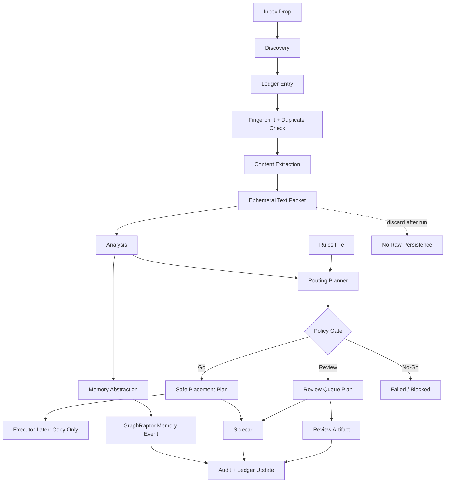

# Universal Inbox ABC Roadmap

Stand: 2026-06-19

Status: execution roadmap for the Nextcloud-backed Universal Inbox pipeline

## Goal

Die Universal Inbox verarbeitet abgelegte Dateien end-to-end so, dass Metadaten, Inhaltsabstraktion, Routing-Entscheidung, sichere Ablageplanung, Sidecar, Ledger und GraphRaptor-Memory klar getrennt, testbar und auditierbar sind.

## Current Evidence

- Commit `379647bb Add universal inbox routing framework` ist auf `fuzzy/dev` gepusht.
- Rules-Datei existiert: `config/universal_inbox_routing_rules.json`.
- Offline Routing Planner existiert: `src/universal_inbox_routing.py`.
- Routing-Tests existieren: `tests/test_universal_inbox_routing.py`.
- Verifikation: `venv\Scripts\python.exe -m pytest tests\test_universal_inbox_routing.py tests\test_nextcloud_intake_ledger.py tests\test_nextcloud_review_queue.py tests\test_nextcloud_tag_governance.py tests\test_nextcloud_source_provider.py` -> `44 passed`.
- Kein aktiver Alice/Bob/Charlie-Thread wurde fuer diese Roadmap uebernommen.

## Non-Goals

- Kein Live-Nextcloud-Zugriff.
- Keine echten Datei-Copies, Moves oder Deletes.
- Keine automatische Canonical-Memory-Promotion.
- Kein Speichern von Rohinhalt in Ledger, Sidecar, Review Queue, Audit oder GraphRaptor.
- Keine finale Privat/Arbeit-Policy bis echte Nutzerregeln entschieden sind.
- Keine OCR-, Audio-, Video- oder Archiv-Extraktion im ersten Ausbauschritt.

## Pipeline Shape



## Memory Rule

GraphRaptor bekommt eine Abstraktion, nicht den Rohinhalt.

Das Extraction Packet ist ephemeral: Es darf waehrend eines Pipeline-Laufs Rohtext, OCR-Zwischenstaende oder Parser-Dumps enthalten, wird aber nicht serialisiert. Die dauerhafte Memory Abstraction ist ein separates Objekt mit abgeleiteten Aussagen und Provenance.

Erlaubt:

- `schema`
- `memory_kind`
- `source_provider`
- `source_hash`
- `source_mime_type`
- `source_size_bytes`
- `original_path`
- `current_path` oder `planned_path`
- `document_type`
- `domain`
- `title`
- `abstract`
- `topics`
- `entities`
- `dates`
- `amounts`
- `relationships`
- `tags`
- `confidence`
- `review_status`
- `routing_policy`
- `routing_decision`
- `provenance`
- `extractor`
- `extracted_at`
- `analyzed_at`
- `routed_at`

Verboten:

- `raw_text`
- `content`
- `body`
- `payload`
- `bytes`
- `binary`
- `ocr_dump`
- `transcript`
- `full_text`
- `page_text`
- `email_body`
- `attachment_bytes`
- `secret`
- `token`
- `password`
- `api_key`
- `credential`
- `chat_id`
- vollstaendige E-Mail- oder PDF-Texte
- vollstaendige Chat-, Tabellen- oder Dokumenttexte
- Secret-Werte, Tokens, Passwoerter, Chat-IDs oder private Kommunikations-IDs

Memory Write Gate:

- Go: Abstraktion enthaelt nur erlaubte Felder, Provenance ist vollstaendig, Confidence und Review-Status sind gesetzt, und keine Rohinhalte oder Secrets werden persistiert.
- Partial: Extraktion war teilweise erfolgreich; sichere abgeleitete Aussagen duerfen nur als `needs_review` Memory-Kandidat geschrieben werden.
- No-Go: Rohinhalt, Secret-Feld, fehlende Provenance, failed Extraction ohne belastbare Abstraktion oder Policy-Block verhindert den Memory Write.

## Stop Rules

- Worktree hat fremde staged files oder Hotfile-Konflikte.
- Tests werden rot und der Fix waere ausserhalb des Slice-Scopes.
- Rohinhalt oder Secret-Werte wuerden persistiert oder in Logs/Handoffs kopiert.
- Live-Nextcloud, Netzwerk, Provider, SSH oder Graph-Write waere noetig.
- Destruktive Git-Kommandos waeren noetig.
- Eine Dateioperation wuerde Delete, Move oder Overwrite bedeuten.

## Slices

### UIX-ABC0 Roadmap

Owner: Charlie

Ziel: Diese Roadmap als Projektwahrheit festhalten.

Allowed files:

- `docs/plans/universal-inbox-abc-roadmap.md`

Done:

- Roadmap committed und pushed.

### UIX-ABC1 Memory Abstraction Contract

Owner: Alice

Execution mode: worker

Reason: docs-only edits are required in the allowed Markdown files.

Ziel: Den Memory-Abstraktionsvertrag so festlegen, dass Rohinhalt nirgendwo dauerhaft in GraphRaptor/Memory landet.

Allowed files:

- `docs/plans/universal-inbox-nextcloud-raptorgraph-contract.md`
- `docs/plans/universal-inbox-abc-roadmap.md`

Requirements:

- Explizite erlaubte und verbotene Memory-Felder.
- Klarer Unterschied zwischen temporarem Extraction Packet und dauerhaftem Memory Event.
- Go/Partial/No-Go Sprache fuer Memory Writes.
- Keine privaten Beispielwerte.

Tests:

- Keine. Docs-only Slice.

### UIX-ABC2 Memory Abstraction Model

Owner: Bob

Execution mode: worker

Reason: focused model and tests are required in isolated files.

Ziel: Ein offline-sicheres Modell fuer `UniversalInboxMemoryAbstraction` bauen, das nur abgeleitete Aussagen und Provenance akzeptiert.

Allowed files:

- `src/universal_inbox_memory.py`
- `tests/test_universal_inbox_memory.py`

Requirements:

- Dataclasses oder leichte Value Objects.
- Redaction/validation fuer verbotene Keys: `raw_text`, `content`, `body`, `payload`, `bytes`, `ocr_dump`, `secret`, `token`, `password`, `chat_id`.
- `to_raptorgraph_event()` liefert nur Abstraktion und Provenance.
- Keine Dateisystem- oder Netzwerkzugriffe.

Tests:

- `venv\Scripts\python.exe -m pytest tests\test_universal_inbox_memory.py`

### UIX-ABC3 Pipeline Run Contract

Owner: Bob

Execution mode: worker

Reason: small offline integration model and tests are required.

Ziel: Einen reinen Pipeline-Run-Envelope bauen, der Discovery, Ledger, Extraction, Analysis, Memory Abstraction, Routing und Policy Gate als Statusobjekte verbindet.

Allowed files:

- `src/universal_inbox_pipeline.py`
- `tests/test_universal_inbox_pipeline.py`

Requirements:

- Keine echten Dateioperationen.
- Extraction Packet ist als ephemeral markiert und wird nicht in `to_dict()` persistiert.
- Pipeline-Output enthaelt Routing Decision und Memory Abstraction Event.
- Review-/No-Go-Gruende werden maschinenlesbar.

Tests:

- `venv\Scripts\python.exe -m pytest tests\test_universal_inbox_pipeline.py tests\test_universal_inbox_memory.py tests\test_universal_inbox_routing.py`

### UIX-ABC4 Policy Gate Integration

Owner: Bob

Execution mode: worker

Reason: focused tests should pin gate behavior before any executor exists.

Ziel: Policy Gate zentralisieren, damit low confidence, duplicate, secret, sensitive, conflict, partial extraction und unknown domain/type eindeutig zu Review oder No-Go fuehren.

Allowed files:

- `src/universal_inbox_policy.py`
- `src/universal_inbox_routing.py`
- `tests/test_universal_inbox_policy.py`
- `tests/test_universal_inbox_routing.py`

Requirements:

- Bestehende Routing-Tests bleiben gruen.
- Policy-Ausgabe ist strukturiert: `go`, `review`, `no_go`.
- Keine Executor- oder Nextcloud-API.

Tests:

- `venv\Scripts\python.exe -m pytest tests\test_universal_inbox_policy.py tests\test_universal_inbox_routing.py`

### UIX-ABC5 Safe Placement Dry-Run

Owner: Bob

Execution mode: worker

Reason: dry-run executor and tests are a concrete repository artifact.

Ziel: Einen Dry-Run Safe-Placement-Plan bauen, der spaeter echte Copy-Operationen vorbereitet, aber noch nichts schreibt.

Allowed files:

- `src/universal_inbox_placement.py`
- `tests/test_universal_inbox_placement.py`

Requirements:

- Nur Plan, keine Kopie.
- Operation immer `copy`.
- `delete_original=false`.
- `overwrite_existing=false`.
- Zielkonflikte erzeugen Review/No-Go statt Ueberschreiben.

Tests:

- `venv\Scripts\python.exe -m pytest tests\test_universal_inbox_placement.py`

### UIX-ABC6 Integration And Release Gate

Owner: Charlie

Execution mode: worker

Reason: integration, focused tests, git hygiene, commit and push are required.

Ziel: Alle Slices integrieren, Scope pruefen, Tests laufen lassen, committen und pushen.

Allowed files:

- `config/universal_inbox_routing_rules.json`
- `docs/plans/universal-inbox-nextcloud-raptorgraph-contract.md`
- `docs/plans/universal-inbox-abc-roadmap.md`
- `src/universal_inbox_*.py`
- `tests/test_universal_inbox_*.py`

Requirements:

- Keine fremden staged files.
- Keine Rohinhalte oder Secrets in Tests/Fixtures.
- Focused Suite gruen.
- `git diff --check` sauber.
- Push auf aktuellen Arbeits-Remote/Branch nur wenn Scope klar ist.

Tests:

- `venv\Scripts\python.exe -m pytest tests\test_universal_inbox_routing.py tests\test_universal_inbox_memory.py tests\test_universal_inbox_pipeline.py tests\test_universal_inbox_policy.py tests\test_universal_inbox_placement.py tests\test_nextcloud_intake_ledger.py tests\test_nextcloud_review_queue.py tests\test_nextcloud_tag_governance.py tests\test_nextcloud_source_provider.py`
- `git diff --check`

## Paths

Alice Path: `UIX-A-docs-contract`

- Contains: UIX-ABC1.
- Complete when docs define raw-content boundaries, abstraction fields, and Go/No-Go language.

Bob Path: `UIX-B-offline-models`

- Contains: UIX-ABC2, UIX-ABC3, UIX-ABC4, UIX-ABC5.
- Complete when offline models and focused tests are green.

Charlie Path: `UIX-C-integration`

- Contains: UIX-ABC0, UIX-ABC6.
- Complete when integrated, tested, committed, pushed, and handoff written.

## Verification

Focused verification:

```text
venv\Scripts\python.exe -m pytest tests\test_universal_inbox_routing.py tests\test_universal_inbox_memory.py tests\test_universal_inbox_pipeline.py tests\test_universal_inbox_policy.py tests\test_universal_inbox_placement.py tests\test_nextcloud_intake_ledger.py tests\test_nextcloud_review_queue.py tests\test_nextcloud_tag_governance.py tests\test_nextcloud_source_provider.py
git diff --check
```

## Release / Go Language

Go:

- Routing, policy, memory abstraction, pipeline envelope and placement dry-run all pass focused tests.
- Rohinhalt ist nicht persistierbar.
- GraphRaptor event contains abstraction plus provenance only.
- No file mutation happens in tests or framework.

Partial:

- Routing and memory abstraction pass, but pipeline envelope or placement dry-run is not complete.
- Docs and code disagree on one non-security detail.

No-Go:

- Any raw content can persist into Ledger, Sidecar, Audit, Review Queue or GraphRaptor event.
- Any executor path can delete, move or overwrite.
- Secrets could be logged or serialized.
- Scope requires live Nextcloud/network access before offline proof is green.

Deferred:

- Real Nextcloud WebDAV/API executor.
- Real GraphRaptor write adapter.
- Full private/work classification policy.
- OCR/audio/video/archive extraction.

## Live-Readiness Continuation

Status: started after commit `b74297ee Build universal inbox offline pipeline`.

Goal:

- Die Universal Inbox ist live-bereit, wenn ein operator-gated Worker neue Dateien aus einer lokalen Nextcloud-Sync-Inbox oder einem gleichwertigen lokalen Inbox-Pfad lesen, stabilitaetspruefen, extrahieren, abstrahieren, routen und als Dry-Run-Plan reporten kann, ohne Datei-Mutation und ohne Rohinhalt-Persistenz.

Non-goals for live-readiness:

- Kein echter Nextcloud-WebDAV-Write.
- Kein echter Copy/Move/Delete.
- Kein GraphRaptor-Live-Write.
- Kein automatisches Tag-Schreiben.
- Kein Ersetzen der lokalen Nextcloud-Rechtepruefung durch Annahmen.

### UIX-ABC7 Local Discovery Adapter

Owner: Bob

Execution mode: worker

Reason: focused implementation and tests are required.

Allowed files:

- `src/universal_inbox_discovery.py`
- `tests/test_universal_inbox_discovery.py`

Requirements:

- Scannt einen lokalen Inbox-Pfad read-only.
- Ignoriert temporaere, versteckte und instabile Dateien.
- Liefert nur Metadaten: relativer Pfad, Dateiname, Size, Mtime, Suffix, SHA-256.
- Keine Datei-Mutation.
- Keine absoluten Hostpfade im serialisierten Report.

Tests:

- `venv\Scripts\python.exe -m pytest tests\test_universal_inbox_discovery.py`

### UIX-ABC8 Content Extraction MVP

Owner: Bob

Execution mode: worker

Reason: focused implementation and tests are required.

Allowed files:

- `src/universal_inbox_extraction.py`
- `tests/test_universal_inbox_extraction.py`

Requirements:

- Extrahiert MVP-Typen: `.txt`, `.md`, `.markdown`, `.json`, `.csv`, `.tsv`, `.html`, `.htm`, `.docx` best effort.
- `.pdf` ist erlaubt als metadata-only oder partial, falls kein sicherer lokaler Parser vorhanden ist.
- Extraction Packet bleibt ephemeral.
- Serialisierte Reports enthalten keine Rohtexte.
- Size limits und warnings sind strukturiert.

Tests:

- `venv\Scripts\python.exe -m pytest tests\test_universal_inbox_extraction.py`

### UIX-ABC9 Intake Worker Dry Run

Owner: Charlie

Execution mode: worker

Reason: integration across discovery, extraction, routing, policy, memory and placement requires scope control.

Allowed files:

- `src/universal_inbox_worker.py`
- `tests/test_universal_inbox_worker.py`
- `src/universal_inbox_*.py`
- `tests/test_universal_inbox_*.py`

Requirements:

- Orchestriert discovery item -> extraction -> analysis stub -> routing -> memory abstraction -> policy -> placement dry-run -> pipeline report.
- Keine echte Datei-Mutation.
- Keine Rohinhalte in `to_dict()`/report.
- Live-Ready-Go nur wenn alle Pläne `go`/`planned` oder bewusst `review` sind und keine `no_go`-Gruende existieren.

Tests:

- `venv\Scripts\python.exe -m pytest tests\test_universal_inbox_worker.py tests\test_universal_inbox_discovery.py tests\test_universal_inbox_extraction.py tests\test_universal_inbox_routing.py tests\test_universal_inbox_memory.py tests\test_universal_inbox_pipeline.py tests\test_universal_inbox_policy.py tests\test_universal_inbox_placement.py`

### UIX-ABC10 Operator Runbook And Go Gate

Owner: Alice

Execution mode: worker

Reason: operator wording and Go/No-Go text are required.

Allowed files:

- `docs/plans/universal-inbox-live-readiness-runbook.md`
- `docs/plans/universal-inbox-abc-roadmap.md`
- `docs/plans/universal-inbox-nextcloud-raptorgraph-contract.md`

Requirements:

- Beschreibt lokale Nextcloud-Sync-Variante und spaeteren WebDAV-Ausbau.
- Enthalt Live-Go-Checkliste mit required folders, env/config, no-delete/no-overwrite, dry-run evidence, tests.
- Enthalt Stop-Regeln fuer Secrets, Hostpfade, Rohinhalt, Delete/Move/Overwrite, unstable files, no mount/sync path.
- Enthalt Operator-Ausgabeformat fuer Go/Partial/No-Go.

Tests:

- Keine. Docs-only Slice.

Output:

- `docs/plans/universal-inbox-live-readiness-runbook.md` defines the operator procedure, local-sync-first model, later WebDAV/API expansion, required folder/config checks, Stop Rules and Go/Partial/No-Go output format.
- Roadmap and Nextcloud/RaptorGraph contract point to the same live-readiness gate language.
- This slice does not commit, push, run live Nextcloud, enable network, or touch implementation files.

### UIX-ABC11 Live Readiness Integration

Owner: Charlie

Execution mode: worker

Reason: final tests, git hygiene, commit, push and automation cleanup are required.

Allowed files:

- `docs/plans/universal-inbox-abc-roadmap.md`
- `docs/plans/universal-inbox-nextcloud-raptorgraph-contract.md`
- `docs/plans/universal-inbox-live-readiness-runbook.md`
- `src/universal_inbox_*.py`
- `tests/test_universal_inbox_*.py`

Verification:

- `venv\Scripts\python.exe -m pytest tests\test_universal_inbox_*.py tests\test_nextcloud_intake_ledger.py tests\test_nextcloud_review_queue.py tests\test_nextcloud_tag_governance.py tests\test_nextcloud_source_provider.py`
- `git diff --check`

Live Go:

- Discovery, Extraction, Worker, Routing, Policy, Memory, Pipeline and Placement tests pass.
- Worker can produce a redacted dry-run evidence report from local fixture files.
- Report contains no raw content and no absolute host paths.
- Any real write path remains disabled/deferred.

## Alice Delegation Prompt

```xml
<codex_delegation>
  <source_thread_id>current-thread</source_thread_id>
  <input>Alice-Slice: UIX-ABC1 Memory Abstraction Contract

Arbeite im Odysseus-Fork an einem kleinen, sicheren Docs-Slice.

Ziel:
- Den Memory-Abstraktionsvertrag fuer die Universal Inbox so schaerfen, dass GraphRaptor/Memory nie Rohinhalt speichert, sondern nur Abstraktion plus Provenance.

Erlaubte Dateien:
- docs/plans/universal-inbox-nextcloud-raptorgraph-contract.md
- docs/plans/universal-inbox-abc-roadmap.md

Nicht anfassen:
- src/
- tests/
- config/
- Live-Nextcloud, Netzwerk, Provider, SSH, Git-History-Rewrite.

Anforderungen:
- Erklaere den Unterschied zwischen ephemeral Extraction Packet und dauerhafter Memory Abstraction.
- Liste erlaubte Memory-Felder.
- Liste verbotene Rohinhalt-/Secret-Felder.
- Definiere Go/Partial/No-Go fuer Memory Writes.
- Keine privaten Inhalte, Tokens, Chat-IDs, Passwoerter oder Hostdetails in Docs.

Tests:
- Keine. Docs-only Slice.

Stop-Regeln:
- Hotfile-Konflikt oder fremde staged files.
- Secrets/Token/Chat-IDs sollen persistiert oder geloggt werden.
- Scope wird verlassen.
- Destruktive Git-Kommandos waeren noetig.

Wenn fertig:
- Status melden.
- Commit-Hash melden, falls committed.
- Geaenderte Dateien nennen.
- Tests und Ergebnis nennen.
- Offene Risiken und Handoff nennen.
  </input>
</codex_delegation>
```

## Bob Delegation Prompt

```xml
<codex_delegation>
  <source_thread_id>current-thread</source_thread_id>
  <input>Bob-Slice: UIX-ABC2 Memory Abstraction Model

Arbeite im Odysseus-Fork an einem kleinen, sicheren Implementierungs-Slice.

Ziel:
- Ein offline-sicheres Universal-Inbox-Memory-Modell implementieren, das nur Abstraktion plus Provenance serialisiert und Rohinhalt blockiert.

Erlaubte Dateien:
- src/universal_inbox_memory.py
- tests/test_universal_inbox_memory.py

Nicht anfassen:
- Live-Nextcloud/API/WebDAV.
- GraphRaptor Live-Writer.
- Existing routing files ausser Imports in Tests, falls noetig.
- Secrets, private Fixtures, reale Dokumenttexte.

Anforderungen:
- Baue `UniversalInboxMemoryAbstraction` oder gleichwertige Value Objects.
- Baue `to_raptorgraph_event()`.
- Blockiere oder redigiere verbotene Keys: raw_text, content, body, payload, bytes, ocr_dump, secret, token, password, chat_id.
- Event enthaelt Provenance: source_hash, original_path, planned/current path, routing_policy, confidence, review_status.
- Keine Datei-, Netzwerk- oder Providerzugriffe.

Tests:
- venv\Scripts\python.exe -m pytest tests\test_universal_inbox_memory.py

Stop-Regeln:
- Hotfile-Konflikt oder fremde staged files.
- Secrets/Token/Chat-IDs sollen persistiert oder geloggt werden.
- Scope wird verlassen.
- Rote Tests ohne klaren fokussierten Fix.
- Destruktive Git-Kommandos waeren noetig.

Wenn fertig:
- Status melden.
- Commit-Hash melden, falls committed.
- Geaenderte Dateien nennen.
- Tests und Ergebnis nennen.
- Offene Risiken und Handoff nennen.
  </input>
</codex_delegation>
```

## Charlie Heartbeat Prompt

```text
Du bist Charlie im Odysseus-Fork und koordinierst die Roadmap `docs/plans/universal-inbox-abc-roadmap.md` bis die Universal-Inbox-Pipeline offline klar ist: Routing, Policy, Memory-Abstraktion, Pipeline-Envelope und Placement-Dry-Run sind testbar und speichern keinen Rohinhalt.

Bei jedem Tick:
1. Pruefe `git status --short --branch`.
2. Lies Alice- und Bob-Handoffs, falls entsprechende Threads gestartet wurden.
3. Wenn ein Agent idle ist ohne done/blocked/handoff, sende denselben aktuellen Slice kurz erneut.
4. Pruefe Scope: Alice darf nur Docs anfassen; Bob darf nur `src/universal_inbox_*.py` und `tests/test_universal_inbox_*.py` anfassen.
5. Stoppe bei Secrets, fremden staged files, destruktiven Git-Kommandos, unklarem Handoff oder Scope-Verletzung.
6. Wenn Bob fertig ist, fuehre die fokussierten Universal-Inbox-Tests aus.
7. Wenn Alice/Bob fertig sind und Worktree sauber ist, integriere minimal, teste, stage nur Scope-Dateien, committe und pushe den aktuellen Branch.
8. Arbeite die Roadmap-Slices der Reihe nach ab.
9. Rotiere Threads erst nach Path-Abschluss mit Handoff-Karte.
10. Wenn das Ziel erreicht ist, loesche diese Automation und benachrichtige den Nutzer.

Ausgabeformat kurz:
`Gesamtfortschritt: XX %`
`Alice-Pfad: XX %`
`Bob-Pfad: XX %`

`Rueckmeldung:` Stand, Tests, Commits, Push und naechste Aktion.
```
